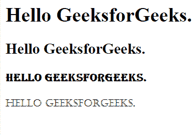
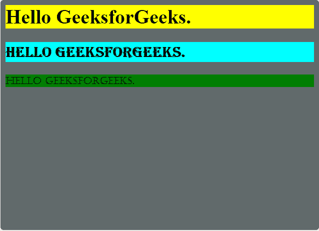

# 如何用 HTML5 定义文档的样式信息？

> 原文:[https://www . geesforgeks . org/如何使用 html5 定义文档样式信息/](https://www.geeksforgeeks.org/how-to-define-style-information-of-a-document-using-html5/)

在本文中，我们通过使用文档中的 **<样式>**
元素来定义文档的样式信息。它用于更改我们在页面上查看的文本。这种改变包括改变字体大小、字体系列、字体颜色等。不仅仅是文本，你也可以改变页面的主体或部分的样式。现在让我们看看样式的各种属性以及标签还支持什么。

**语法:**

```html
<tagname style="property:value;">
```

**示例 1:** 以下示例演示了如何使用 HTML5 定义文档的样式信息。

```html
<!DOCTYPE html>
<html>

<head>
    <title>
        How to define style information
        for a document using HTML5?
    </title>
</head>

<body>
    <h1 style="font-family:commanders;">
        Hello GeeksforGeeks.
    </h1>

    <h2 style="font-family:Chaparral Pro Light;">
        Hello GeeksforGeeks.
    </h2>

    <h3 style="font-family:algerian;">
        Hello GeeksforGeeks.
    </h3>

    <p style="font-family:Castellar;">
        Hello GeeksforGeeks.
    </p>
</body>

</html>
```

**输出:**


**例 2:**

```html
<!DOCTYPE html>
<html>

<head>
    <title>
        How to define style information
        for a document using HTML5?
    </title>
</head>

<body style="background-color:#616A6B;">

    <h1 style="font-family:commanders; 
        background-color:yellow;">
        Hello GeeksforGeeks.
    </h1>

    <h2 style="font-family:algerian; 
        background-color:cyan;">
        Hello GeeksforGeeks.
    </h2>

    <p style="font-family:Castellar; 
        background-color:green;">
        Hello GeeksforGeeks.
    </p>
</body>

</html>
```

**输出:**


**支持的浏览器如下:**

*   谷歌 Chrome
*   微软公司出品的 web 浏览器
*   火狐浏览器
*   歌剧
*   旅行队