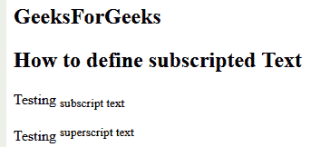
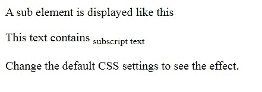

# html 5 中如何定义下标文字？

> 原文:[https://www . geesforgeks . org/如何定义-html5 中的下标文本/](https://www.geeksforgeeks.org/how-to-define-subscripted-text-in-html5/)

在本文中，我们使用文档中的**子**元素来定义 HTML 中的下标文本。此标签用于向 HTML 文档添加下标文本。<子>标签定义下标文本。下标文本出现在正常行下方半个字符处，有时以较小的字体呈现。下标文字可以用于化学式，就像 H2O 被写成 H2O 一样。
**语法:**

```html
<sub> ----- content--- </sub>
```

**例 1:**

```html
<!DOCTYPE html> 
<html> 

<body>
    <h2>GeeksForGeeks</h2>
    <h2>How to define subscripted Text</h2>
    <p>Testing <sub>subscript text</sub></p> 
    <p>Testing <sup>superscript text</sup></p> 
</body> 

</html>                     
```

**输出:**


**例 2:**

```html
<!DOCTYPE html> 
<html> 

<head> 
    <style> 
        sub { 
            vertical-align: sub; 
            font-size: small; 
        } 
    </style> 
</head> 

<body> 
    <p>A sub element is displayed like this</p> 
    <p>This text contains <sub>subscript text</sub></p> 
    <p>Change the default CSS settings to see the effect.</p> 
</body> 

</html> 
```

**输出:**
