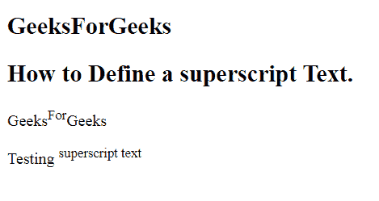
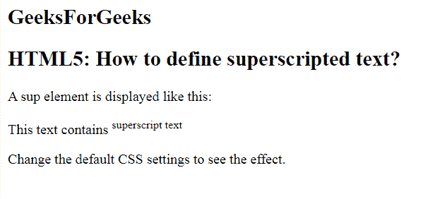

# 如何用 HTML5 定义上标文字？

> 原文:[https://www . geesforgeks . org/如何使用-html5/](https://www.geeksforgeeks.org/how-to-define-superscripted-text-using-html5/) 定义上标文本

在本文中，我们将使用<sup>标签设置一个上标文本。它用于向 HTML 文档添加上标文本。 **sup** 标签定义了上标文本。上标文本出现在正常行上方半个字符处，有时以较小的字体呈现。上标文本可用于脚注。</sup>

**语法:**

```html
<sup> Contents... </sup>
```

**例 1:**

```html
<!DOCTYPE html>
<html>

<head>
    <title>
        Define a superscript text
    </title>
</head>

<body>
    <h2>
        GeeksForGeeks
    </h2>
    <h2>
        How to Define a superscript Text.
    </h2>

    <p>
        Geeks<sup>For</sup>Geeks
    </p>

    <p>
        Testing <sup>superscript text</sup>
    </p>
</body>

</html>
```

**输出:**


**例 2:**

```html
<!DOCTYPE html>
<html>

<head>
    <style>
        sup {
            vertical-align: super;
            font-size: small;
        }
    </style>
</head>

<body>
    <h2>
        GeeksForGeeks
    </h2>

    <h2>
        HTML5: How to define 
        superscripted text?
    </h2>

    <p>
        A sup element is 
        displayed like this:
    </p>

    <p>
        This text contains 
        <sup>superscript text</sup>
    </p>

    <p>
        Change the default CSS 
        settings to see the effect.
    </p>
</body>

</html>
```

**输出:**


**支持的浏览器:**

*   谷歌 Chrome
*   微软公司出品的 web 浏览器
*   火狐浏览器
*   歌剧
*   旅行队