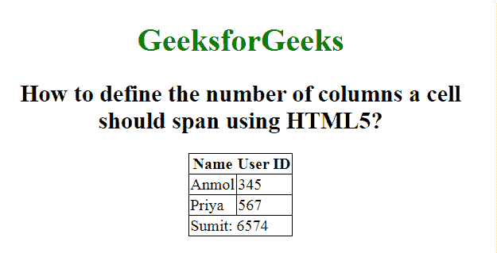

# 如何用 HTML5 定义单元格应该跨越的列数？

> 原文:[https://www . geeksforgeeks . org/如何使用 html5 定义单元格应该跨越的列数/](https://www.geeksforgeeks.org/how-to-define-the-number-of-columns-a-cell-should-span-using-html5/)

本文将向您展示如何使一列跨越多个单元格。当使用**<>**标记时，这是使用 **colspan** 属性完成的。这允许单个表格单元格跨越多个单元格或列的宽度。它提供了类似于 Excel 等电子表格程序中“合并单元格”功能的功能。

**语法:**

```html
<td colspan = "value">table content...</td>
```

**示例:**

```html
<!DOCTYPE html>
<html>

<head>
    <style>
        body {
            text-align: center;
        }

        h1 {
            color: green;
        }

        table,
        tbody,
        td {
            border: 1px solid black;
            border-collapse: collapse;
        }
    </style>
</head>

<body>
    <h1>GeeksforGeeks</h1>

    <h2>
        How to define the number of
        columns a cell should span
        using HTML5?
    </h2>

    <table>

        <!-- The <tr> tag starts here -->
        <tr>
            <th>Name</th>
            <th>User ID</th>
        </tr>
        <tr>
            <td>Anmol</td>
            <td>345</td>
        </tr>
        <tr>
            <td>Priya</td>
            <td>567</td>
        </tr>

        <!-- The last row -->
        <tr>
            <!-- This td will span two 
                columns, that is a single 
                column will take up the 
                space of 2 -->
            <td colspan="2">
                Sumit: 6574
            </td>
        </tr>
    </table>
</body>

</html>
```

**输出:**



**支持的浏览器:**

*   谷歌 Chrome
*   微软公司出品的 web 浏览器
*   火狐浏览器
*   歌剧
*   旅行队