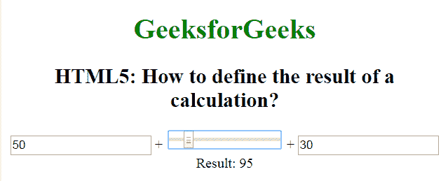

# 如何用 HTML5 定义一个计算的结果？

> 原文:[https://www . geesforgeks . org/如何使用 html5 定义计算结果/](https://www.geeksforgeeks.org/how-to-define-the-result-of-a-calculation-using-html5/)

在本文中，我们将学习如何定义计算结果。 **[<输出>标记](https://www.geeksforgeeks.org/html-output-tag/)** 用于表示由客户端脚本(如 JavaScript)执行的计算结果。<输出>标签是 HTML5 中的一个新标签，它需要一个开始和结束标签。

**语法:**

```html
<output> Results... </output>
```

**示例:**

```html
<!DOCTYPE html>
<html>

<head>
    <title>
        Define the result 
        of a calculation
    </title>

    <style>
        body {
            text-align: center;
        }

        h1 {
            color: green;
        }
    </style>
</head>

<body>
    <h1>GeeksforGeeks</h1>

    <h2>
        HTML5: How to define the 
        result of a calculation?
    </h2>

    <form oninput="sumresult.value = parseInt(A.value) 
                + parseInt(B.value) + parseInt(C.value)">
        <input type="number" name="A" value="50" /> +
        <input type="range" name="B" value="0" /> +
        <input type="number" name="C" value="30" />
        <br>
        Result: <output name="sumresult"></output>
    </form>
</body>

</html>                
```

**输出:**


**支持的浏览器:**

*   谷歌 Chrome
*   微软公司出品的 web 浏览器
*   火狐浏览器
*   歌剧
*   旅行队