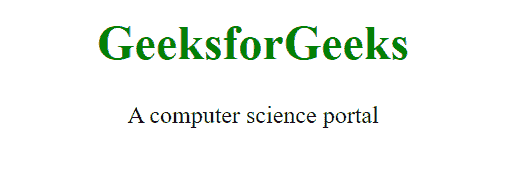

# 如何定义一个 HTML 文档的根？

> 原文:[https://www . geesforgeks . org/如何定义 html 文档的根/](https://www.geeksforgeeks.org/how-to-define-the-root-of-an-html-document/)

HTML 中的标记用于定义 HTML 和 XHTML 文档的根。标签告诉浏览器它是一个 HTML 文档。它是 HTML 文档中出现的所有内容的第二个外部容器，后面跟着标签。标签需要一个开始和结束标签。

**语法:**

```html
<html> HTML Contents... </html>
```

**属性值:**<html>标签包含单属性 *xmlns* ，其属性值为*http://www.w3.org/1999/xhtml*。它用于定义命名空间属性。

**例 1:**

## 超文本标记语言

```html
<!DOCTYPE html>
<html>
<head>
    <title>
        How to define the root
        of an HTML document?
    </title>
</head>
<body style="text-align: center;">
    <h1 style="color: green;">
        GeeksforGeeks
    </h1>

    <p>
        A computer science portal
    </p>

</body>
</html>
```

**输出:**



**例 2:**

## 超文本标记语言

```html
<!DOCTYPE html
    PUBLIC "-//W3C//DTD XHTML 1.0 Transitional//EN" 
"http://www.w3.org/TR/xhtml1/DTD/xhtml1-transitional.dtd">
<html xmlns="http://www.w3.org/1999/xhtml">
<head>
    <title>
        How to define the root
        of an HTML document?
    </title>
</head>
<body style="text-align: center;">
    <h1 style="color: green;">
        GeeksforGeeks
    </h1>

    <p>
        A computer science portal
    </p>
</body>

</html>
```

**输出:**


**支持的浏览器:**

*   谷歌 Chrome
*   微软公司出品的 web 浏览器
*   火狐浏览器
*   歌剧
*   旅行队