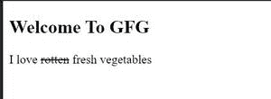

# 如何定义 HTML5 中不再正确的文本？

> 原文:[https://www . geesforgeks . org/如何定义 html5 中不再正确的文本/](https://www.geeksforgeeks.org/how-to-define-the-text-that-is-no-longer-correct-in-html5/)

在本文中，我们将学习如何定义 HTML5 中不再正确的文本。在开始阅读本内容之前，我们假设您对 HTML 有基本的了解。

**方法 1:** 为此，我们将使用<的>标签。<的>标签是一个 HTML 标签，用于指定不再正确、准确或相关的文本。该标签不应用于定义文档中删除的文本。为此，我们使用< del >标签。

**语法:**

```html
<s> write some text here </s>
```

**示例:**

## 超文本标记语言

```html
<!DOCTYPE html>
<html>
    <body>
        <h2>Welcome To GFG</h2>

<p>I love <s>rotten</s>fresh vegetables</p>

    </body>
</html>
</html>
```

**输出:**



**方法 2:** 我们可以通过使用 CSS 中的*文本装饰*属性来执行相同的任务。此属性指定添加到文本中的装饰。

**语法:**

```html
text-decoration: line-through;
```

**示例:**

## 超文本标记语言

```html
<!DOCTYPE html>
<html>
    <head>
        <style>
            span {
                text-decoration: line-through;
            }
        </style>
    </head>

    <body>
        <h2>Welcome To GFG</h2>

<p>I love<span> rotten </span>fresh vegetables</p>

    </body>
</html>
```

**输出:**

