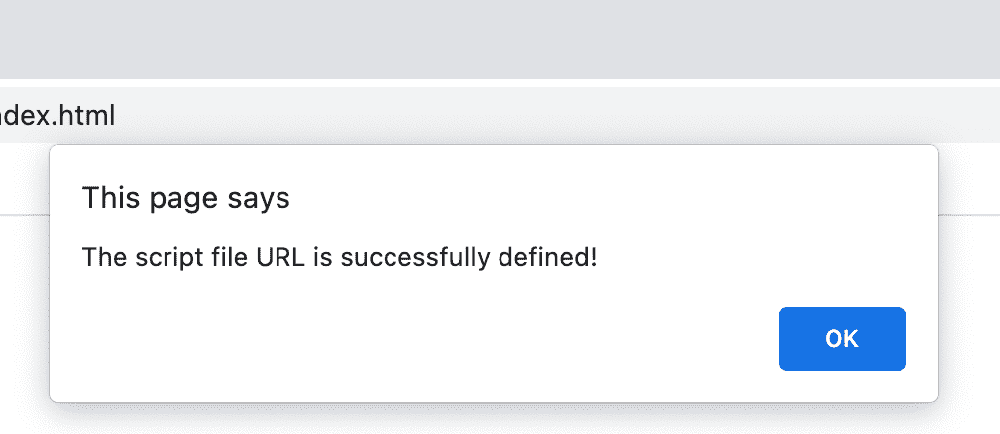

# 如何在 HTML5 中定义外部脚本文件的 URL？

> 原文:[https://www . geesforgeks . org/如何定义 html5 中的外部脚本文件 URL/](https://www.geeksforgeeks.org/how-to-define-the-url-of-an-external-script-file-in-html5/)

在本文中，我们将学习如何在 HTML 中定义外部脚本文件的 URL。当需要包含大的脚本代码时，这可能是需要的，如果所有代码都写在一个文件中，这可能会造成混乱。此外，可能需要在不同的网页上执行相同的脚本，重写相同的代码会导致冗余。只需在单独的文件中编写脚本代码，并在 HTML 文件中定义它，就可以重构代码。

**方法:**脚本标签有一个属性 **src** ，用来指定外部脚本文件的路径。

**语法:**

```html
<script src="examplescript.js"></script>
```

**示例:**在本例中，*示例脚本. js* 外部脚本要包含在 HTML 文件中。

## 范例脚本. js

```html
alert("The script file URL is successfully defined");
```

## index.html

```html
<html>
  <body>
    <h1 style="color: green">
      GeeksforGeeks
    </h1>

    <!-- Including an external script -->
    <script src="examplescript.js">
    </script>
  </body>
</html>
```

**输出:**在我们的浏览器中加载页面时，我们将获得一个带有已定义消息的弹出窗口，该消息确认外部脚本已正确加载。

