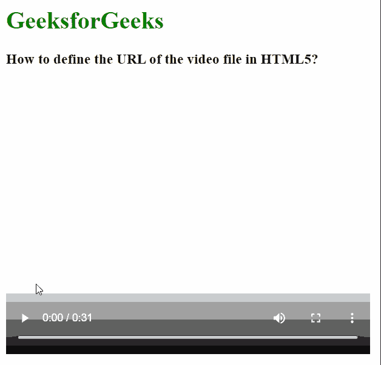
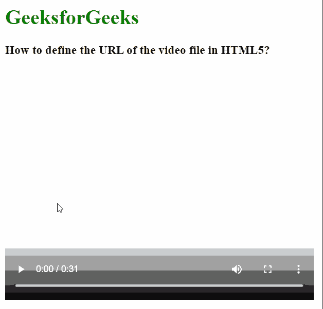

# 如何在 HTML5 中定义视频文件的 URL？

> 原文:[https://www . geesforgeks . org/如何定义 html5 中视频文件的 URL/](https://www.geeksforgeeks.org/how-to-define-the-url-of-the-video-file-in-html5/)

在本文中，我们将学习如何在 HTML 中定义视频的 URL。[*<>*](https://www.geeksforgeeks.org/html-video-src-attribute/)标签用于在网页上嵌入视频文件。这将根据浏览器显示视频播放器和播放器控件。视频源可以是单一的，也可以支持多种格式的视频，以便多个浏览器支持视频播放。

**方法:****[<视频>标签](https://www.geeksforgeeks.org/html5-video/)** 有一个属性 ***src*** ，用来指定视频文件的加载路径。当要指定多个源时，***src*****属性也可以与每个 [*<源>*](https://www.geeksforgeeks.org/html-source-tag/) 标签一起使用，以定义该源视频文件的路径。我们将使用这个属性来定义视频文件的 URL。**

****语法:****

```html
<video src="path_to_video.mp4"></video>
```

**或者**

```html
<video>
  <source src="path_to_video.mp4" type="video/mp4">
  <source src="path_to_video.ogg" type="video/ogg">
</video>
```

****示例 1:** 在本例中，属性与 *<视频>* 标签一起使用。它说明了 ***src*** 属性来定义视频文件的 URL。**

## **超文本标记语言**

```html
<html>
<body>
  <h1 style="color: green;">
    GeeksforGeeks
  </h1>
  <h3>
    How to define the URL of 
    the video file in HTML5?
  </h3>

  <!-- Specify the source of
  the video file -->
  <video src=
"https://media.geeksforgeeks.org/wp-content/uploads/20210314115545/sample-video.mp4"
        width="480" height="360" controls>
    The browser does not support videos.
  </video>
</body>
</html>
```

****输出:****

****

****示例 2:** 在本例中，该属性与<源>标签一起使用来定义多个视频源。**

## **超文本标记语言**

```html
<html>
<body>
  <h1 style="color: green;">
    GeeksforGeeks
  </h1>
  <h3>
    How to define the URL of the
    video file in HTML5?
  </h3>
  <video width="480" height="360" controls>

    <!-- Specify the source of
    the video file -->
    <source src="sample-video.mp4"
            type="video/mp4">
    <source src="sample-video.ogg" 
            type="video/ogg">
    The browser does not support videos.
  </video>
</body>
</html>
```

****输出:****

****