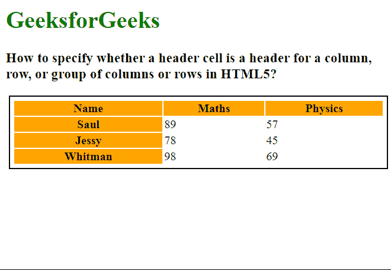

# 如何定义 HTML 5 中的标题单元格是列、行还是一组列或行的标题？

> 原文:[https://www . geesforgeks . org/如何定义标题单元格是 html-5 中的列行标题还是列组标题/](https://www.geeksforgeeks.org/how-to-define-wether-a-header-cell-is-a-header-for-a-column-row-or-group-of-columns-or-rows-in-html-5/)

在本文中，我们将学习如何指定标题单元格是列、行还是一组列或行的标题。第[<>](https://www.geeksforgeeks.org/html-th-tag/)标签用于指定一个 [*<表格>*](https://www.geeksforgeeks.org/html-tables/) 元素的标题，通常用于表格的列。但是，在特定情况下，标题可用于定义一行或一组列或行的标题。

**进场:**

第<>标签的[](https://www.geeksforgeeks.org/html-scope-attribute/)****属性用于指定标题的范围，即可以用来定义标题是针对一列、一行还是一组列和行。可用的关键字值有*行、列、行组、*和*列组*。****

******语法:******

```html
**<th scope="rows|cols|rowgroup|colgroup">**
```

****下面的例子说明了 ***范围*** 属性来指定标题单元格的范围。****

******示例:******

## ****超文本标记语言****

```html
**<html>
<style>
 table {
    border: 2px solid;
    padding: 4px;
    margin: 4px;
    width: 100%;
  }

  th {
    background-color: orange;
  }
</style>

<body>
  <h1 style="color: green;">
    GeeksforGeeks
  </h1>
  <h3>
    How to specify whether a header cell is
    a header for a column, row, or group of
    columns or rows in HTML5?
  </h3>

  <table>
    <tr>

      <!-- Specifying the scope of the headings
      on the columns of the table -->
      <th scope="col">Name</th>
      <th scope="col">Maths</th>
      <th scope="col">Physics</th>
    </tr>
    <tr>

      <!-- Specifying the scope of the heading
      on the row of the table -->
      <th scope="row">Saul</th>
      <td>89</td>
      <td>57</td>
    </tr>
    <tr>

      <!-- Specifying the scope of the heading
      on the row of the table -->
      <th scope="row">Jessy</th>
      <td>78</td>
      <td>45</td>
    </tr>
    <tr>

      <!-- Specifying the scope of the heading
      on the row of the table -->
      <th scope="row">Whitman</th>
      <td>98</td>
      <td>69</td>
    </tr>
  </table>
</body>
</html>**
```

******输出:**缩写不会显示，因为普通网络浏览器不会显示它们。****

****

作用域的属性****