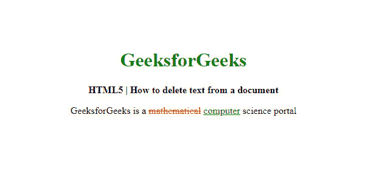

# 如何使用 HTML 从文档中删除文本？

> 原文:[https://www . geesforgeks . org/如何使用 html 从文档中删除文本/](https://www.geeksforgeeks.org/how-to-delete-text-from-document-using-html/)

在本文中，我们通过使用文档中的 **[< del >标记](https://www.geeksforgeeks.org/html-del-tag/)** 来删除 HTML 文档中的文本。该标记代表删除，用于标记已从文档中删除的部分文本。

**语法:**

```html
<del> Contents... </del>
```

**示例:**在以下示例中，演示了从文档中删除文本。

```html
<!DOCTYPE html>
<html>

<head>
    <title>
        How to delete text from a 
        document using HTML?
    </title>

    <style>
        del {
            color: red;
        }

        ins {
            color: green;
        }

        h1 {
            color: green;
        }

        body {
            text-align: center;
        }
    </style>
</head>

<body>
    <h1>GeeksforGeeks</h1>

    <b>
        HTML5 | How to delete 
        text from a document 
    </b>

    <p>
        GeeksforGeeks is a 
        <del>mathematical</del>
        <ins>computer</ins> 
        science portal
    </p>
</body>

</html>
```

**输出:** 

**支持的浏览器:**

*   谷歌 Chrome
*   微软公司出品的 web 浏览器
*   火狐浏览器
*   歌剧
*   旅行队