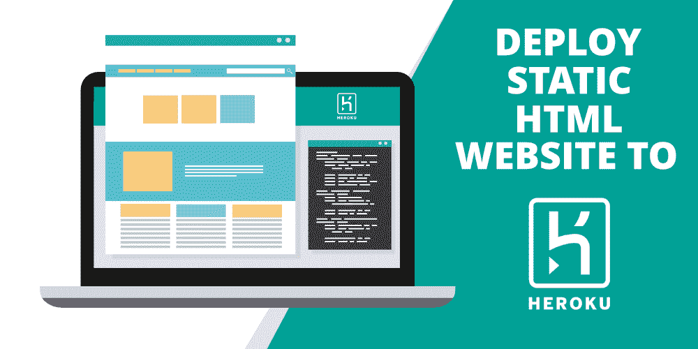

# 如何将一个基本的静态 HTML 网站部署到 Heroku？

> 原文:[https://www . geesforgeks . org/如何部署-a-basic-static-html-网站-to-heroku/](https://www.geeksforgeeks.org/how-to-deploy-a-basic-static-html-website-to-heroku/)

Heroku 是一个简单的一站式解决方案，可以托管任何网站或服务器。本文围绕如何在 Heroku 上托管自己的**静态 HTML 网页展开。**为了演示这一点，我们将构建一个简单的网页并托管它。



### 先决条件

*   饭桶
*   英雄库账户
*   Heroku CLI

让我们为我们的项目创建一个名为**“portfolio”**的目录。我们将这个目录连接到我们的 Heroku 应用程序，这样每当我们更新本地 HTML 文件时，更改都会反映在托管网站上。

#### **第一步:**

创建一个名为**“portfolio”**的目录，并将工作目录改为该目录。

```html
$ mkdir portfolio
$ cd portfolio

```

#### **第二步:**

创建自己的静态 HTML 网站，并将其命名为“**home . HTML”**(我们将创建一个简单的文件，其中只有“我的投资组合”作为文本)

```html
$ echo "<h1> My Portfolio </h1>" > home.html 

```

#### **第三步:**

默认情况下，Heroku 不允许您部署没有后端的应用程序。因此，我们需要创建一个虚拟后端或动态 PHP 文件。我们需要使用一个技巧，告诉 Heroku 我们的网站是一个 PHP 应用程序。为此，只需在您的终端中复制并粘贴以下命令。composer.json 已经被包含进来，为 Heroku 上的 PHP 应用程序提供支持。如果一个应用程序没有 composer 依赖项，我们必须包含空的 composer.json 来识别 PHP 应用程序。

```html
$ echo '<?php include_once("home.html"); ?>' > index.php
$ echo '{}' > composer.json

```

#### **第四步:**

将存储库初始化为 git 存储库。

```html
$ git init

```

#### **第五步:**

使用 Heroku 仪表板右上角的**新**按钮创建您的 [Heroku](http://heroku.com) 应用程序。我们将把这个应用命名为“**你的-应用名-123”**

#### **第六步:**

使用 Heroku 命令行界面登录您的 Heroku 帐户

```html
$ heroku login

```

#### **第七步:**

现在我们已经创建了我们的应用程序，我们只需要将本地 git 存储库连接到 Heroku 应用程序。为此，我们将 Heroku 应用程序的遥控器添加到 git 存储库中。(别忘了用自己的应用名称替换“你的应用名称-123”)

```html
$ heroku git:remote -a your-app-name-123

```

#### **第八步:**

将更改推送到您的 Heroku 应用程序。

```html
$ git push heroku master

```

#### **第九步:**

您的应用程序现已在 Heroku 上线。要查看您的应用程序，请点击上一步结束时出现的链接，该链接看起来像**https://your-app-name-123.herokuapp.com/**。要提交并保存对您的**home.html**文件的所有更改，从您的**“文件夹”**目录执行以下命令。

```html
$ git add . 
$ git commit -m "your commit message" 
$ git push heroku master

```