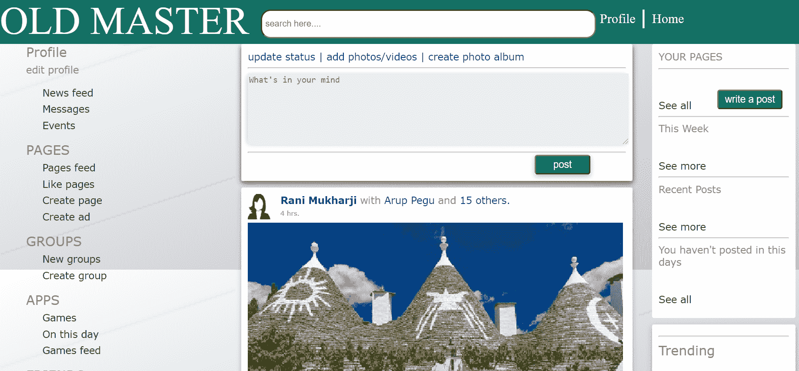

# 如何用 HTML 和 CSS 设计出像脸书一样的主页？

> 原文:[https://www . geesforgeks . org/how-design-home page-like-Facebook-using-html-and-CSS/](https://www.geeksforgeeks.org/how-to-design-homepage-like-facebook-using-html-and-css/)

[**HTML:**](https://www.geeksforgeeks.org/html-tutorials/) HTML 代表超文本标记语言。它用于使用标记语言设计网页。HTML 是超文本和标记语言的结合。超文本定义了网页之间的链接。标记语言用于在定义网页结构的标签中定义文本文档。

[**CSS:**](https://www.geeksforgeeks.org/css-tutorials/) 层叠样式表，被亲切地称为 CSS，是一种简单设计的语言，旨在简化网页呈现的过程。CSS 允许您将样式应用于网页。更重要的是，CSS 使您能够独立于组成每个网页的 HTML 来完成这项工作。

以下是[脸书 like 主页建设源代码:](https://miniyadav1.github.io/restaurant/facebook1/)

可以查看 [**Github 链接**](https://github.com/miniyadav1/restaurant/tree/master/facebook1) 下载本文完整代码。

**HTML 部分**:文件名为 homepage1.html

## 超文本标记语言

```html
<!DOCTYPE html>
<html>

<head>
    <meta charset="UTF-8">
    <meta name="viewport" content=
        "width=device-width, initial-scale=1.0">
    <link rel="stylesheet" type="text/css" 
        href="new.css" media="screen" />
</head>

<body>
    <div class=" header1">
        <div id="name" class="header1">
            OLD MASTER
        </div>
        <div id="searcharea" class="header1">
            <input placeholder="search here...." 
                type="text" id="searchbox" />
        </div>
        <div id="profilearea" class="header1">Profile</div>
        <div id="profilearea1" class="header1">|</div>
        <div id="profilearea2" class="header1">Home</div>
    </div>
    <div class="sidenav">
        <div class="bodyn">
            <div id="side1" class="bodyn">Profile</div>
            <div id="side2" class="bodyn">edit profile</div>
            <div id="side3" class="bodyn">News feed</div>
            <div id="side4" class="bodyn">Messages</div>
            <div id="side5" class="bodyn">Events</div>
            <div id="side6" class="bodyn">PAGES</div>
            <div id="side7" class="bodyn">Pages feed</div>
            <div id="side8" class="bodyn">Like pages</div>
            <div id="side9" class="bodyn">Create page</div>
            <div id="side10" class="bodyn">Create ad</div>
            <div id="side11" class="bodyn">GROUPS</div>
            <div id="side12" class="bodyn">New groups</div>
            <div id="side13" class="bodyn">Create group</div>
            <div id="side14" class="bodyn">APPS</div>
            <div id="side15" class="bodyn">Games</div>
            <div id="side16" class="bodyn">On this day</div>
            <div id="side17" class="bodyn">Games feed</div>
            <div id="side18" class="bodyn">FRIENDS</div>
            <div id="side19" class="bodyn">Close friends</div>
            <div id="side20" class="bodyn">Family</div>
            <div id="side21" class="bodyn">INTERESTS</div>
            <div id="side22" class="bodyn">Pages and public</div>
            <div id="side23" class="bodyn">EVENTS</div>
            <div id="side24" class="bodyn">Create event</div>
        </div>
    </div>
    <div class="post00"></div>
    <div class="post10"></div>

    <div class="header0001"></div>
    <div class="sideboxxx"></div>
    <div class="sideboxxxx2"></div>
    <div class="post">
        <div id="column-1" class="post">
            update status | add photos/
            videos | create photo album
            <hr><br><br><br><br><br><br>
            <hr>
        </div>
        <div id="postpos" class="post">
            <input type="submit" id="buttonpost" value="post" />
        </div>
        <div id="postboxpos" class="post">
            <textarea placeholder="What's in your mind" 
                id="postbox">
            </textarea>
        </div>
    </div>
    <div class="post1">
        <br>
        <br><br>
        <p6>Like Comment Share</p6><br>
        <hr>
        <p1>Amit Deb</p1>
        <p2> and</p2>
        <p1> 5 others</p1>
        <p2> like this</p2>
        <div id="post2text" class="post1">
            <p3>Rani Mukharji </p3>
            <p2>with </p2>
            <p1> Arup Pegu</p1>
            <p2> and</p2>
            <p1> 15 others.</p1><br>
            <p4>4 hrs.</p4>
        </div>
        <div id="commentprof2" class="post1">
            
        </div>
        <div id="commentboxpos2" class="post1">
            <input type="text" placeholder="comment" 
                id="commentbox" />
        </div>
    </div>
    <div class="sidebox">
        <div id="sidebox1" class="sidebox">
            <div id="sideboxx1">YOUR PAGES</div>
            <hr><br><br>See all
            <hr>
            <div id="sideboxx2">
                This Week
            </div><br><br>See more
            <hr>
            <div id="sideboxx3">
                Recent Posts
            </div><br><br>See more
            <hr>
            <div id="sideboxx4">
                You haven't posted in this days
            </div><br><br><br>See all
        </div>

        <div id="post1pos" class="sidebox">
            <input type="submit" id="buttonpost1" 
                value="write a post" />
        </div>
    </div>
    <div class="sideboxxx2">
        <div id="sidebox2" class="sideboxxx2">
            <hr>
            <div id="sideboxx21">Trending</div>
            <br><br><br>See more
            <hr>
            <div id="sideboxx22">
                Suggested Pages
            </div><br><br><br>See all
            <hr>
            <div id="sideboxx23">
                People you may know
            </div><br><br><br><br>See all
        </div>
    </div>
</body>

</html>
```

**CSS 节:**文件名为 new.css

从 Github 下载 HTML、CSS 和图片文件，将所有文件保存在一个文件夹中，运行**homepage1.html**文件。它会显示结果。

**输出:**

