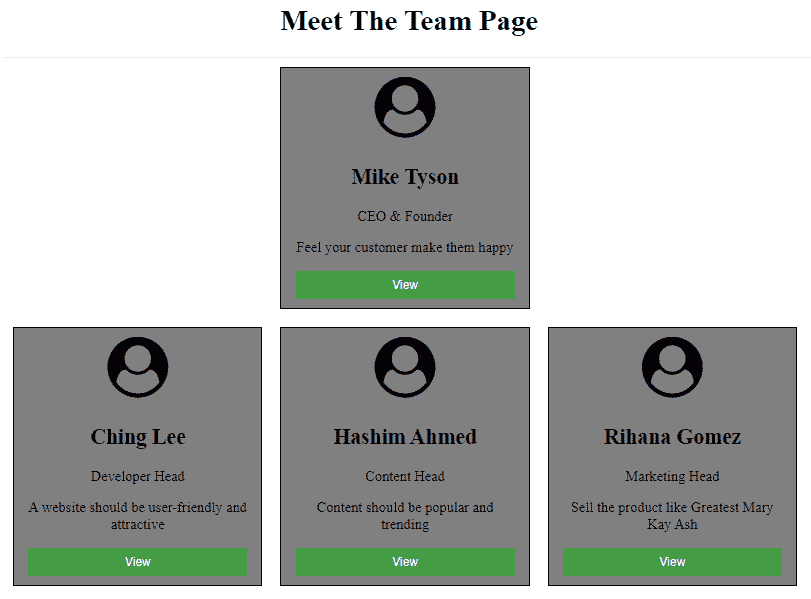

# 如何使用 HTML 和 CSS 设计《遇见团队》页面？

> 原文:[https://www . geeksforgeeks . org/如何使用 html 和 css 设计团队会议页面/](https://www.geeksforgeeks.org/how-to-design-meet-the-team-page-using-html-and-css/)



**创建结构:**在本节中，我们将为“会见团队”页面创建一个基本结构。我们会附上图标，并把文字放在会员的卡片上会添加按钮。

*   **字体超赞图标的 CDN 链接:**

> <link rel="”stylesheet”" href="”https://cdnjs.cloudflare.com/ajax/libs/font-awesome/4.7.0/css/font-awesome.min.css”">

*   **HTML 代码:**该 HTML 代码用于创建满足团队页面的结构。因为它不包含 CSS，所以它只是一个基本结构。我们将使用一些 CSS 属性使其具有吸引力。

## 超文本标记语言

```html
<!DOCTYPE html>
<html>

<head>
    <meta name="viewport"
        content="width=device-width, initial-scale=1">

    <!-- linking font awesome for icons -->
    <link rel="stylesheet" href=
"https://cdnjs.cloudflare.com/ajax/libs/font-awesome/4.7.0/css/font-awesome.min.css">
</head>

<body>
    <center>
        <h1>Meet The Team Page</h1>
        <hr>

        <!-- First member of the team -->
        <div class="row">
            <div class="column" id="gfg">
                <div class="card">
                    <i class="fa fa-user-circle"
                    style="font-size:68px;"></i>
                    <div class="container">
                        <h2>Mike Tyson</h2>

<p>CEO & Founder</p>

<p>
                            Feel your customer make
                            them happy
                        </p>

                        <button class="button">View</button>
                    </div>
                </div>
            </div>
        </div>

        <!-- Other members of the team -->
        <div class="row">
            <div class="column">
                <div class="card">
                    <i class="fa fa-user-circle"
                    style="font-size:68px;"></i>
                    <div class="container">
                        <h2>Ching Lee</h2>

<p>Developer Head</p>

<p>
                            A website should be user-friendly
                            and attractive
                        </p>

                        <button class="button">View</button>
                    </div>
                </div>
            </div>

            <div class="column">
                <div class="card">
                    <i class="fa fa-user-circle"
                    style="font-size:68px;"></i>
                    <div class="container">
                        <h2>Hashim Ahmed</h2>

<p>Content Head</p>

<p>
                            Content should be popular
                            and trending
                        </p>

                        <button class="button">View</button>
                    </div>
                </div>
            </div>
            <div class="column">
                <div class="card">
                    <i class="fa fa-user-circle"
                    style="font-size:68px;"></i>
                    <div class="container">
                        <h2>Rihana Gomez</h2>

<p>Marketing Head</p>

<p>
                            Sell the product like
                            Greatest Mary Kay Ash
                        </p>

                        <button class="button">View</button>
                    </div>
                </div>
            </div>
        </div>
    </center>
</body>

</html>
```