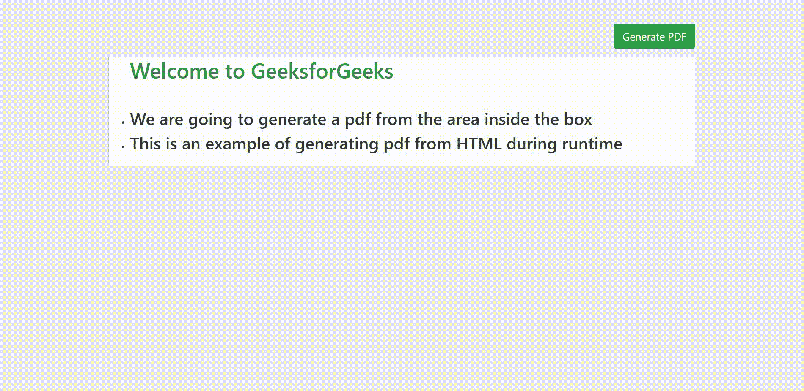
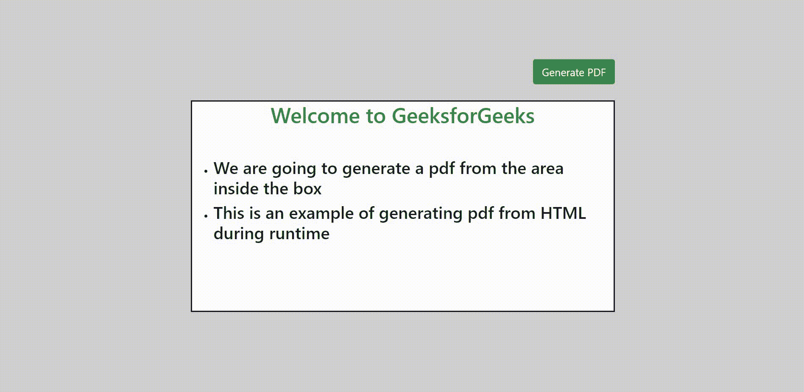
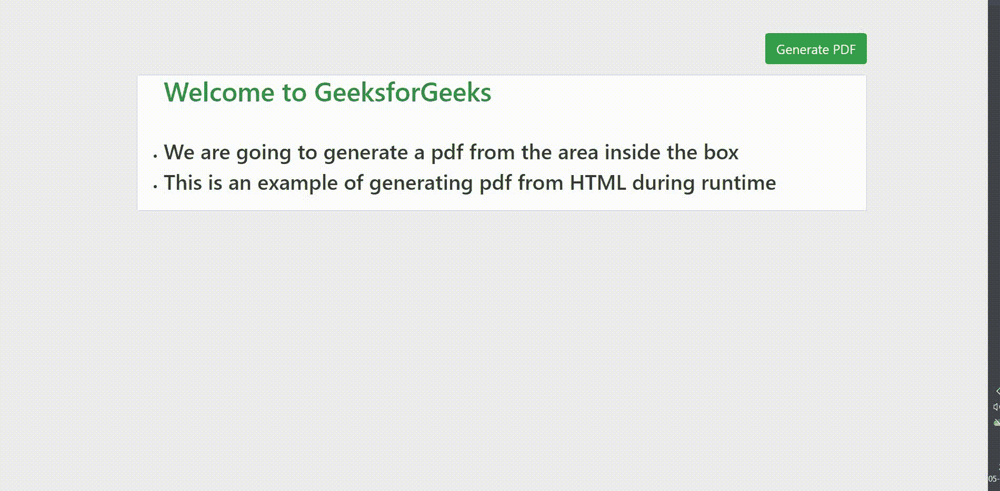

# 如何通过 HTML 设计运行时生成的 PDF？

> 原文:[https://www . geesforgeks . org/how-design-runtime-generated-pdf-via-html/](https://www.geeksforgeeks.org/how-to-design-runtime-generated-pdf-via-html/)

很多时候，我们都面临着在使用浏览器时，需要以 pdf 文件的形式保存特定网页或任何在线特定元素的问题。在这种情况下，我们要么使用第三方扩展，要么使用任何应用程序或工具将其生成 pdf 文件。在本文中，我们将学习通过 HTML 设计运行时生成的 pdf 文件。这项任务可以通过 3 种方式实现:

*   打印特定网页并将其保存为 PDF
*   使用 jsPDF 库
*   使用 html2pdf 库

让我们借助例子来逐一理解这 3 个概念。

**1。打印特定元素并保存为 PDF:**

我们将生成一个窗口，并在运行时将其保存为 pdf。这类似于系统的默认打印功能。下面讨论这些步骤。

*   使用“**窗口创建一个新窗口。打开**方法。
*   在那个窗口中为我们的标签编写内部 HTML。
*   打印窗口
*   关窗

**示例:**在本例中，我们将使用 html2pdf CDN 链接，该链接将有助于生成 pdf 文件。

## 超文本标记语言

```html
<!DOCTYPE html>
<html lang="en">

<head>

    <!-- html2pdf CDN-->
    <script src=
"https://cdnjs.cloudflare.com/ajax/libs/html2pdf.js/0.9.2/html2pdf.bundle.js">
    </script>

    <style>
        .container {
            position: fixed;
            top: 20%;
            left: 28%;
            margin-top: -65px;
            margin-left: -100px;
            border-radius: 7px;
        }

        .card {
            box-sizing: content-box;
            width: 700px;
            height: 150px;
            padding: 30px;
            border: 1px solid black;
            font-style: sans-serif;
            background-color: #f0f0f0;
        }

        #button {
            background-color: #4caf50;
            border-radius: 5px;
            margin-left: 650px;
            margin-bottom: 5px;
            color: white;
        }

        h2 {
            text-align: center;
            color: #24650b;
        }
    </style>
</head>

<body>
    <div class="container">
        <button id="button">Generate PDF</button>
        <div class="card" id="makepdf">
            <h2>Welcome to GeeksforGeeks</h2>
            <ul>
                <li>
                    <h4>
                        We are going to generate a pdf 
                        from the area inside the box
                    </h4>
                </li>
                <li>
                    <h4>
                        This is an example of generating 
                        pdf from HTML during runtime
                    </h4>
                </li>
            </ul>
        </div>
    </div>
</body>

<script>
    var button = document.getElementById("button");
    var makepdf = document.getElementById("makepdf");

    button.addEventListener("click", function () {
        var mywindow = window.open("", "PRINT", 
                "height=400,width=600");

        mywindow.document.write(makepdf.innerHTML);

        mywindow.document.close();
        mywindow.focus();

        mywindow.print();
        mywindow.close();

        return true;
    });
</script>

</html>
```

**输出:**



**2。使用 jsPDF 库:**

为了在运行时生成一个 pdf，我们可以使用 jsPDF 库。步骤如下:

*   在 HTML 文档的标签中包含 jsPDF CDN。CDN 如下，在谷歌搜索‘JSPdF CDN’获取最新版本。
*   使用“从 HTML”方法从 HTML div 生成一个 pdf。
*   使用 javascript 中的 *save()* 方法保存文件。

**示例:**

## 超文本标记语言

```html
<!DOCTYPE html>
<html>

<head>
    <title>jsPDF Library</title>

        <!--JSPDF CDN-->
        <script src=
"https://cdnjs.cloudflare.com/ajax/libs/jspdf/1.3.2/jspdf.min.js">
        </script>

    <style>
        .container {
            position: fixed;
            top: 20%;
            left: 28%;
            margin-top: -65px;
            margin-left: -100px;
            border-radius: 7px;
        }

        #makepdf {
            box-sizing: content-box;
            width: 700px;
            height: 150px;
            padding: 30px;
            border: 1px solid black;
            font-style: sans-serif;
            background-color: #f0f0f0;
        }

        #button {
            background-color: #4caf50;
            border-radius: 5px;
            margin-left: 650px;
            margin-bottom: 5px;
            color: white;
        }

        h2 {
            text-align: center;
            color: #24650b;
        }
    </style>
</head>

<body>
    <div class="container">
        <button id="button">Generate PDF</button>
        <div id="makepdf">
            <h2>Welcome to GeeksforGeeks</h2>
            <ul>
                <li>
                    <h4>
                        We are going to generate a pdf 
                        from the area inside the box
                    </h4>
                </li>
                <li>
                    <h4>
                        This is an example of generating 
                        pdf from HTML during runtime
                    </h4>
                </li>
            </ul>
        </div>
    </div>

    <script>
        var button = document.getElementById("button");
        button.addEventListener("click", function () {
            var doc = new jsPDF("p", "mm", [300, 300]);
            var makePDF = document.querySelector("#makepdf");

            // fromHTML Method
            doc.fromHTML(makePDF);
            doc.save("output.pdf");
        });
    </script>
</body>

</html>
```

**输出:**



**3。使用 html2pdf 库:**

使用 html2pdf 库生成 pdf 文件的步骤如下:

*   在 html 文档的顶部包含 html2pdf CDN。CDN 如下，在谷歌搜索“html2pdf CDN”获取最新版本。
*   使用 html2pdf()对象生成 pdf。这是 html2pdf 库的默认对象。
*   保存 pdf。

**示例:**

## 超文本标记语言

```html
<!DOCTYPE html>
<html lang="en">

<head>

    <!-- html2pdf CDN-->
    <script src=
"https://cdnjs.cloudflare.com/ajax/libs/html2pdf.js/0.9.2/html2pdf.bundle.js">
    </script>

    <style>
        .container {
            position: fixed;
            top: 20%;
            left: 28%;
            margin-top: -65px;
            margin-left: -100px;
            border-radius: 7px;
        }

        .card {
            box-sizing: content-box;
            width: 700px;
            height: 150px;
            padding: 30px;
            border: 1px solid black;
            font-style: sans-serif;
            background-color: #f0f0f0;
        }

        #button {
            background-color: #4caf50;
            border-radius: 5px;
            margin-left: 650px;
            margin-bottom: 5px;
            color: white;
        }

        h2 {
            text-align: center;
            color: #24650b;
        }
    </style>
</head>

<body>
    <div class="container">
        <button id="button">Generate PDF</button>
        <div class="card" id="makepdf">
            <h2>Welcome to GeeksforGeeks</h2>
            <ul>
                <li>
                    <h4>
                        We are going to generate a pdf 
                        from the area inside the box
                    </h4>
                </li>
                <li>
                    <h4>
                        This is an example of generating 
                        pdf from HTML during runtime
                    </h4>
                </li>
            </ul>
        </div>
    </div>

    <script>
        var button = document.getElementById("button");
        var makepdf = document.getElementById("makepdf");

        button.addEventListener("click", function () {
            html2pdf().from(makepdf).save();
        });
    </script>
</body>

</html>
```

**输出:**

