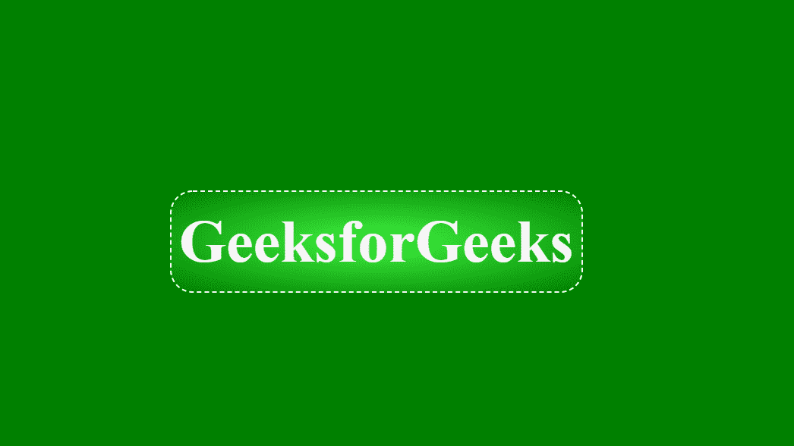

# 如何使用 HTML 和 CSS 设计按钮的拼接发光效果？

> 原文:[https://www . geesforgeks . org/如何设计-使用 html 和 css 为按钮缝合发光效果/](https://www.geeksforgeeks.org/how-to-design-stitched-glowing-effect-for-button-using-html-and-css/)

缝合发光效果一般用于古典或复古主题网站的设计。如果使用蓝色作为效果，也可以称之为牛仔布效果，因为它看起来类似于经典的原始牛仔布。理解[径向梯度](https://www.geeksforgeeks.org/css-radial-gradient-function/)和*虚线*边界属性的概念是最好的效果之一。

**方法:**方法很简单，我们将使用虚线属性表示缝合效果，使用径向渐变表示辉光效果。下面的代码是上述方法的实现。

**示例:**

```html
<!DOCTYPE html>
<html lang="en">
<head>
  <meta charset="UTF-8">
  <meta name="viewport" content=
      "width=device-width,
      initial-scale=1.0">
  <title>Stiched Effect</title>

  <style>
    body{
      margin: 0;
      padding: 0;
      background: green;

    }
    .geeks{
      position: absolute;
      top: 35%;
      left: 30%;
      font-size:80px;
      color: whitesmoke;
      background: radial-gradient(
          rgb(64, 245, 64), green);
      padding:20px 10px;
      border-radius: 30px;
      border: 2px dashed white;
    }
  </style>
</head>
<body>
  <button class="geeks">
    GeeksforGeeks
  </button>
</body>
</html>
```

在上面的例子中，我们有一个

# 元素，首先我们将它与页面中心对齐，然后应用径向渐变属性给它一个发光效果，边框虚线属性给它一个缝合效果。边框半径完全是可选的，它的使用取决于个人喜好。

**输出:**
