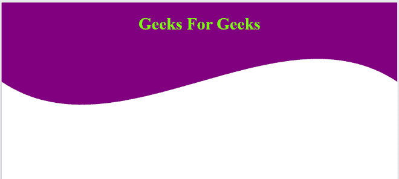

# 如何在 HTML 中设计波浪图像？

> 原文:[https://www . geesforgeks . org/how-to-design-wave-image-in-html/](https://www.geeksforgeeks.org/how-to-design-wave-image-in-html/)

Waves 是可以在 HTML 页面上生成的简单设计，可以增强网站的整体外观，使其更具吸引力和设计感。在 CSS 和 HTML 的帮助下，这些波可以用于设计登录页面、图像、响应按钮、产品和网页区域的背景。可以是静态波，也可以是涉及偏好的动画波。

波浪可以通过两种方式产生:

*   使用 [*::在*](https://www.geeksforgeeks.org/css-before-selector/) 和 [*之前:*](https://www.geeksforgeeks.org/css-after-selector/) 之后的选择器
*   使用 [SVG](https://www.geeksforgeeks.org/svg-image-tag/) 方法。

**优点和缺点:*****:*之前和*:*之后选择器方法要求精确的像素位置，因此我们得到动态波，波的模式不断变化。然而，SVG 是在网页上显示波形的最佳方式。它能迅速为网站生成外观一致的波浪形图案。**

****HTML 代码:**下面的例子演示了如何设计一个 SVG 波。**

## **超文本标记语言**

```html
<!DOCTYPE html>
<html>

<head>
    <style>
        body {
            overflow: hidden;
        }
        svg {
            display: inline-block;
            position: absolute;
            top: 0;
            left:0;
            z-index: -1;
        }
        .container {
            display: inline-block;
            position: absolute;
            width: 100%;
            padding-bottom: 100%;
            vertical-align: middle;
            overflow: hidden;
            top: 0;
            left: 0;
        }
        }
    </style>
</head>

<body style="text-align:center;">
    <h1 style="color:lawngreen;">
        Geeks For Geeks
    </h1>

    <div class="container">

        <!-- Creating a SVG image -->
        <svg viewBox="0 0 500 500"
            preserveAspectRatio="xMinYMin meet">

            <path d="M0, 100 C150, 200 350,
                0 500, 100 L500, 00 L0, 0 Z"
                style="stroke:none; fill:purple;">
            </path>
        </svg>
    </div>
</body>

</html>
```

****输出:****

**

生成波**