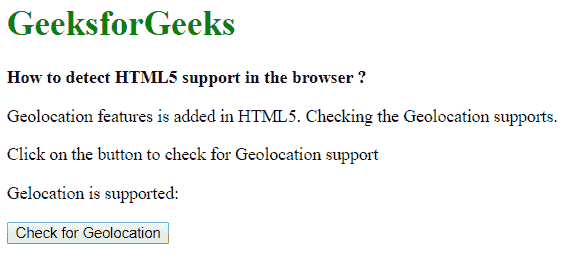
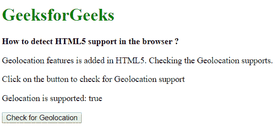
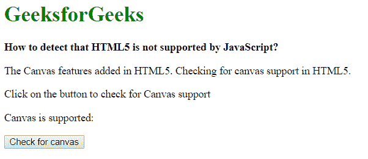
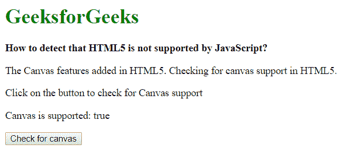
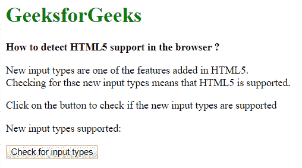
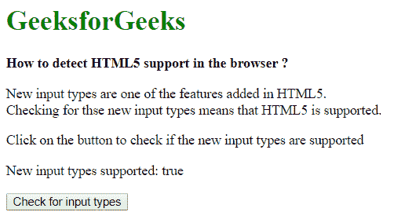

# 如何检测浏览器中是否支持 HTML 5？

> 原文:[https://www . geesforgeks . org/如何检测-html-5-在浏览器中被支持或不被支持/](https://www.geeksforgeeks.org/how-to-detect-html-5-is-supported-or-not-in-the-browser/)

HTML 5 是 HTML 的最新标准，包括许多新的变化和功能。HTML5 支持可以通过三种方式检测:
**方法 1:检查地理位置支持:**在 HTML 5 中增加了地理位置 API。它用于识别用户的位置。可以通过检查导航器对象中是否存在**地理位置**属性来检测该应用编程接口的存在。这是通过使用 navigator.geolocation 完成的，它返回 geolocation 对象。如果对象存在，说明浏览器支持 HTML5。
**例:**

## 超文本标记语言

```html
<!DOCTYPE html>
<html>

<head>
    <title>
        How to detect HTML 5 is supported
        or not in the browser ?
    </title>
</head>

<body>
    <h1 style="color: green">
        GeeksforGeeks
    </h1>

    <b>
        How to detect HTML5 support
        in the browser ?
    </b>

<p>
        Geolocation features is added in HTML5.
        Checking the Geolocation supports.
    </p>

<p>
        Click on the button to check
        for Geolocation support
    </p>

<p>
        Gelocation is supported:
        <span class="output"></span>
    </p>

    <button onclick="checkGeolocation()">
        Check for Geolocation
    </button>

    <script type="text/javascript">

        function checkGeolocation() {
            if (navigator.geolocation)
                isSupported = true;
            else
                isSupported = false;

            document.querySelector('.output').textContent
                    = isSupported;
        }
    </script>
</body>

</html>
```

**输出:**

*   **点击按钮前:**



*   **点击按钮后:**



**方法 2:检查画布元素:**画布元素用于渲染形状或位图元素。这是 HTML5 中增加的新功能。
画布元素有一个 **getContext()** 方法，用于返回画布元素的绘制上下文。如果不支持上下文标识符，它将返回空值。此属性可用于检查画布元素是否受支持。
使用 document.createElement()方法创建一个新的画布元素。通过在创建的输入对象上访问 getContext 方法来检查该方法。用 if 语句检查此表达式的结果。如果结果为真，说明浏览器支持 HTML5。
**例:**

## 超文本标记语言

```html
<!DOCTYPE html>
<html>

<head>
    <title>
        How to detect HTML 5 is supported
        or not in the browser ?
    </title>
</head>

<body>
    <h1 style="color: green">
        GeeksforGeeks
    </h1>

    <b>
        How to detect that HTML5 is
        not supported by JavaScript?
    </b>

<p>
        The Canvas features added in HTML5\. Checking
        for canvas support in HTML5.
    </p>

<p>
        Click on the button to check
        for Canvas support
    </p>

<p>
        Canvas is supported:
        <span class="output"></span>
    </p>

    <button onclick="checkCanvas()">
        Check for canvas
    </button>

    <script type="text/javascript">
        function checkCanvas() {

            if (document.createElement('canvas').getContext)
                isSupported = true;
            else
                isSupported = false;

            document.querySelector('.output').textContent
                    = isSupported;
        }
    </script>
</body>

</html>
```

**输出:**

*   **点击按钮前:**



*   **点击按钮后:**



**方法 3:检查文本输入类型:** HTML5 引入了新的输入类型，可用于输入具有验证的不同形式的数据。HTML5 之前的输入元素不支持这些新类型，使用它们会自动恢复为默认的“文本”类型。这可以用来检查浏览器是否支持 HTML5。
使用 document.createElement()方法创建一个新的输入元素。然后在创建的元素上使用 setAttribute 方法，将输入类型设置为任何较新的输入类型。使用 if 语句检查此元素的类型，看它是否与默认的“text”值匹配。如果该值没有恢复到默认设置，则意味着浏览器支持 HTML5。
**例:**

## 超文本标记语言

```html
<!DOCTYPE html>
<html>

<head>
    <title>
        How to detect HTML 5 is supported
        or not in the browser ?
    </title>
</head>

<body>
    <h1 style="color: green">
        GeeksforGeeks
    </h1>

    <b>
        How to detect HTML5 support
        in the browser ?
    </b>

<p>
        New input types are one of the
        features added in HTML5\. <br>
        Checking for the new input types
        means that HTML5 is supported.
    </p>

<p>
        Click on the button to check if
        the new input types are supported
    </p>

<p>
        New input types supported:
        <span class="output"></span>
    </p>

    <button onclick="checkInputType()">
        Check for input types
    </button>

    <script type="text/javascript">
        function checkInputType() {
            let tempElement = document.createElement("input");
            tempElement.setAttribute("type", "color");

            // Check if the type attribute falls back
            // to default text type
            if (tempElement.type !== "text")
                isSupported = true;
            else
                isSupported = false;

            document.querySelector('.output').textContent
                    = isSupported;
        }
    </script>
</body>

</html>
```

**输出:**

*   **点击按钮前:**



*   **点击按钮后:**

