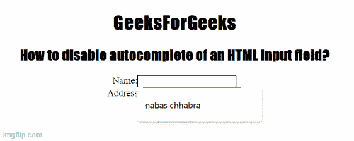

# 如何禁用 HTML 输入字段的自动完成功能？

> 原文:[https://www . geesforgeks . org/如何禁用 html 输入字段的自动完成功能/](https://www.geeksforgeeks.org/how-to-disable-autocomplete-of-an-html-input-field/)

在本文中，我们将学习如何在 [HTML](https://www.geeksforgeeks.org/html-tutorials/) 表单中禁用或关闭特定输入字段的自动完成功能。我们知道，自动完成功能用于允许浏览器根据用户之前输入的值，是否自动完成填充的输入数据值。因为最新的浏览器默认支持启用自动完成。自动完成功能加快了填写表单的过程。在互联网使用率低或会话过期的情况下，如果启用了自动完成功能，浏览器会自动填充用户之前输入的数据值。

**自动完成属性取两个值:**

*   **开:**指定启用自动完成。
*   **关闭:**指定自动完成被禁用。

**如果您想禁用自动完成功能，请遵循下面给出的方法:**

**进场:**

*   首先我们创建一个包含<input>标签的 HTML 文档。
*   使用带有自动完成属性的<input>标签
*   将自动完成属性设置为值“关闭”。

**示例:**下面的代码演示了一个表单有两个输入字段，一个字段的自动完成状态为打开，另一个字段的自动完成功能为关闭。

## 超文本标记语言

```html
<!DOCTYPE html>
<html>

<head>
    <title>
        How to disable autocomplete 
        of an HTML input field?
    </title>

    <style>
        h1,
        h2 {
            font-family: impact;
        }
    </style>
</head>

<body style="text-align:center;">

    <h1>GeeksForGeeks</h1>

    <h2>
        How to disable autocomplete 
        of an HTML input field?
    </h2>

    <form id="myGeeks">
        Name:<input type="text" id="text_id" 
            name="geeks" autocomplete="on">
        <br>
        Address: <input type="Address" 
            name="address" autocomplete="off">
        <br><br>

        <input type="submit">
    </form>
</body>

</html>
```

**输出:**

