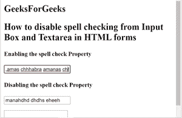

# 如何在 HTML 表单中禁用输入框和文本区的拼写检查？

> 原文:[https://www . geesforgeks . org/如何禁用 html 表单中输入框和文本区域的拼写检查/](https://www.geeksforgeeks.org/how-to-disable-spell-checking-from-input-box-and-textarea-in-html-forms/)

基本上，当我们在 HTML 表单的<input>或<textarea>字段中输入语法错误的单词时，会使用拼写检查功能的概念，您会在错误的单词下方看到红色下划线。它用于检测文本字段中的语法或拼写错误。</textarea>

要禁用 HTML 表单中的拼写检查，拼写检查属性设置为“假”。下面是禁用拼写检查的示例 HTML 程序。

**示例:**

## 超文本标记语言

```html
<!DOCTYPE html>
<html>
<body>
<h2>a
    GeeksForGeeks
</h2>
  <h2>
      How to disable spell checking
from Input Box and Textarea in HTML forms

  </h2>
    <form>
    <h4>Enabling the spell check Property</h4>
      <input type="text" spellcheck="true">

<h4> Disabling the spell check Property</h4>
            <input type="text" spellcheck="false">
        </p>

<p>
            <textarea spellcheck="false"></textarea>
        </p>

        <button type="reset">Reset</button>
    </form>
</body>
</html>
```

**输出:**



**支持的浏览器如下:**

*   谷歌 Chrome
*   微软公司出品的 web 浏览器
*   火狐浏览器
*   歌剧
*   旅行队