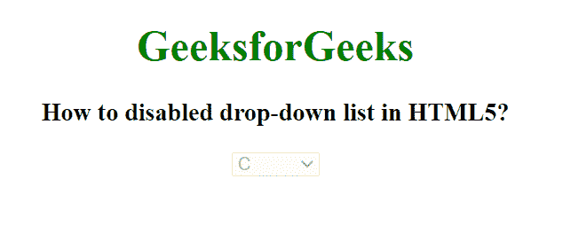

# 如何禁用 HTML5 中的下拉列表？

> 原文:[https://www . geesforgeks . org/如何禁用 html5 中的下拉列表/](https://www.geeksforgeeks.org/how-to-disable-the-drop-down-list-in-html5/)

下拉列表用于创建需要选择元素的项目列表。我们使用<select>和<option>元素来创建下拉列表，并使用</option></select>元素中的禁用属性来禁用下拉列表元素。禁用的下拉列表不可点击且不可用。它是一个布尔属性。

**语法:**

```html
<select disabled> Option values... </select>
```

**属性值:**

*   **禁用:**<选择>禁用属性用于指定禁用选择元素。禁用的下拉列表不可点击且不可用。它是一个布尔属性。

**示例:**

## 超文本标记语言

```html
<!DOCTYPE html>
<html>

<head>
    <title>
        How to disabled drop-down list in HTML5?
    </title>
</head>

<body style="text-align: center;">
    <h1 style="color: green;">
        GeeksforGeeks
    </h1>

    <h3>
        How to disabled drop-down list in HTML5?
    </h3>

    <select disabled>
        <option value="c">C</option>
        <option value="cpp">C++</option>
        <option value="java">Java</option>
        <option value="python">Python</option>
    </select>
</body>

</html>
```

**输出:**

