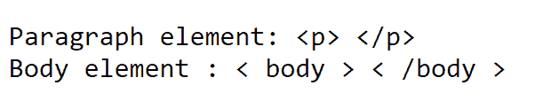
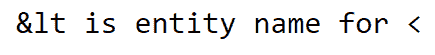

# 如何在 HTML 中将 HTML 标签显示为纯文本？

> 原文:[https://www . geesforgeks . org/how-display-html-tags-as-plain-text-in-html/](https://www.geeksforgeeks.org/how-to-display-html-tags-as-plain-text-in-html/)

基本上，有两种方法可以将 HTML 标记显示为纯文本。

**1。使用<明文>元素:**明文元素不推荐使用，这意味着不再支持该功能。虽然某些浏览器可能仍然支持它，但不建议使用。

**2。html 实体:**第二个也是唯一可用的选项是使用 HTML 实体。<、>是 html 中的保留字符，为了显示这些保留字符，您必须用 HTML 实体替换它们。您可以在这里了解更多关于实体[的信息。您可以使用实体名称或实体编号，以 **&** 初始化，以**结束；**](https://www.geeksforgeeks.org/html-entities/)

所需 html 实体见下表:

<figure class="table">

| 符号 | describe | Entity name | Entity number |
| < | Less than (start of html element) | & lt | 60； |
| > | Greater than (end of html element) | & gt | 62； |
|  | double quotation mark | " | 34； |
|  | [amp (beginning of HTML entity)] | 和。 | 38； |

</figure>

**示例 1:** 在第一个示例中，我们使用 html 实体名称在网页上显示正文元素和段落元素。

## 超文本标记语言

```html
<!DOCTYPE html>
<html>

<head>
    <title>Plain text </title>
</head>

<body>
    <pre>
        Paragraph element: <p> </p>
        Body element : < body > < /body >
    </pre>
</body>

</html>
```

**输出:**



输出

**说明:**在上面的代码中，**“<”**、**“>”**只是被它们各自的 html 实体所代替。**<pre></pre>**是定义预格式化文本的 html 元素。

**示例 2:** 在下面的示例中，我们试图使用**&**符号的实体名称来显示**<**的 html 实体名称。

## 超文本标记语言

```html
<!DOCTYPE html>
<html lang="en">

<head>
    <title>Plain text demo</title>
</head>

<body>
    <pre>
        < is entity name for <
    </pre>
</body>

</html>
```

**输出:**



输出

**说明:**上例中**&**替换为**&amp****“<”**替换为**“&lt；”**