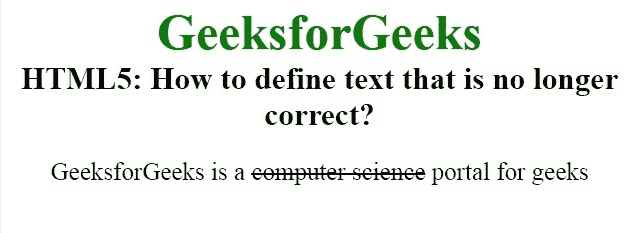
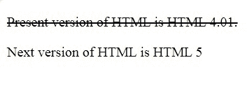

# 如何使用 HTML5 显示不正确的内容？

> 原文:[https://www . geesforgeks . org/如何显示-不正确的内容-使用-html5/](https://www.geeksforgeeks.org/how-to-display-incorrect-content-using-html5/)

在本文中，我们将使用文档中的 **[< s >标记](https://www.geeksforgeeks.org/html-s-tag/)** 来显示不正确的文本。该标签与< del >标签相似，但略有不同。它不是用来替换或删除文本的，而是 [< del >](https://www.geeksforgeeks.org/html-del-tag/) 标签用来替换或删除文本的。

**语法:**

```html
<s> Contents... </s>
```

**例 1:**

```html
<!DOCTYPE html>
<html>

<head>
    <title>
        How to define text that 
        is no longer correct?
    </title>

    <style>
        body {
            text-align: center;
        }

        .gfg {
            font-size: 40px;
            font-weight: bold;
            color: green;
        }

        .geeks {
            font-size: 25px;
            font-weight: bold;
        }

        p {
            font-size: 20px;
        }
    </style>
</head>

<body>
    <div class="gfg">
        GeeksforGeeks
    </div>

    <div class="geeks">
        HTML5: How to define text 
        that is no longer correct?
    </div>

    <p>
        GeeksforGeeks is a
        <s>computer science</s>
        portal for geeks
    </p>
</body>

</html>
```

**输出:**


**例 2:**

```html
<!DOCTYPE html>
<html>

<head>
    <title>
        How to define text that
        is no longer correct
    </title>
</head>

<body>
    <p>
        <s>
            Present version of 
            HTML is HTML 4.01.
        </s>
    </p>

    <p>
        Next version of 
        HTML is HTML 5
    </p>
</body>

</html>
```

**输出:**


**支持的浏览器:**

*   谷歌 Chrome
*   微软公司出品的 web 浏览器
*   火狐浏览器
*   歌剧
*   旅行队