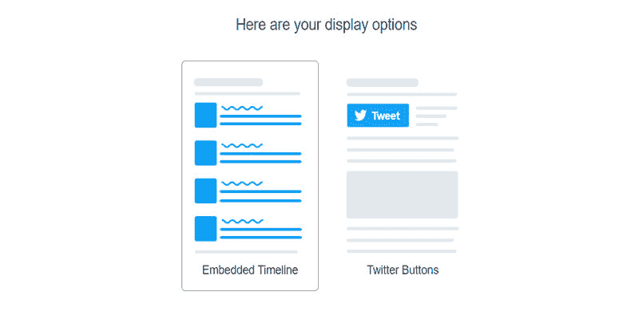
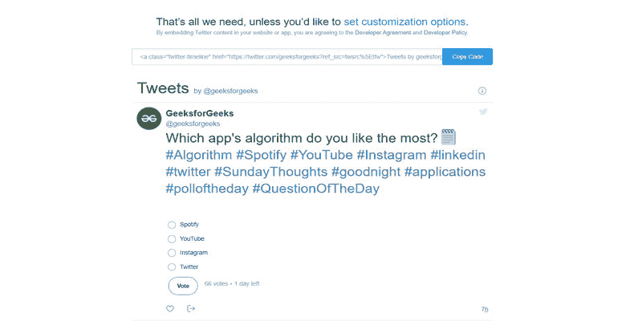

# 如何使用 HTML 显示推特账号的最新推文？

> 原文:[https://www . geeksforgeeks . org/如何使用 html 显示来自推特账户的最新推文/](https://www.geeksforgeeks.org/how-to-display-latest-tweets-from-a-twitter-account-using-html/)

在本文中，我们将看到如何使用 HTML 在我们的网页上显示任何用户的推文。

推特是最受欢迎的社交媒体平台之一。这是一项美国社交网络服务，用户可以在上面发布被称为“推文”的消息并与之互动。只有注册用户可以发推、喜欢和转发他人的推文，但未注册用户也可以阅读那些公开的推文。每个人都想在他们的博客网站上显示他们的推文。所以，在这篇文章中，我们将讨论如何借助 [HTML 以最简单的方式在我们的网站上显示某人的推文。](https://www.geeksforgeeks.org/html-tutorials/)

**方法:**下面是分步实施。

**第一步:**参观[https://publish.twitter.com/](https://publish.twitter.com/#)

*   输入您想向其显示推文的个人资料链接。前 https://twitter.com/geeksforgeeks


输入网址

**第二步:**之后，这里会弹出一个新页面点击**嵌入时间轴。**



选择嵌入的时间线

**第三步:**然后你会得到你的 HTML 代码和账号推文的预览。复制 HTML 代码。



试映

*   它看起来和下面的代码一样，但是 href 值会有变化。
*   您也可以使用此代码并将 href 值更改为您的个人资料帐户 url。

**语法:**

## 超文本标记语言

```html
<a class="twitter-timeline" 
    href="https://twitter.com/geeksforgeeks?ref_src=twsrc%5Etfw">
    <!-- In your code value of href tag will be changed -->
    Tweets by Geeksforgeeks
</a>

<script async src=
"https://platform.twitter.com/widgets.js" charset="utf-8">
</script>

<!-- It's a javascript file which will perform 
all actions which we need to show tweets-->
```

**第四步:**把上面的代码添加到你想要显示推文的 HTML 文件中，并添加一些 CSS，让它看起来更加美观方便。

**示例:**

## 超文本标记语言

```html
<!DOCTYPE html>
<html>
  <head>
    <title>Tweets</title>
  </head>
  <body>
    <a class="twitter-timeline" href=
       "https://twitter.com/geeksforgeeks?ref_src=twsrc%5Etfw">
      <!-- In your code value of href tag will be changed -->
      Tweets by Geeksforgeeks
    </a>

    <script async src=
"https://platform.twitter.com/widgets.js" charset="utf-8">
    </script>
    <!-- It's a javascript file which will perform all 
          actions which we need to show tweets-->
  </body>
</html>
```

**输出:**


输出