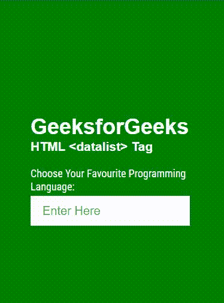

# 如何在 HTML 中显示输入字段的建议？

> 原文:[https://www . geeksforgeeks . org/如何显示-建议-输入-html 中的字段/](https://www.geeksforgeeks.org/how-to-display-suggestions-for-input-field-in-html/)

一般来说，我们已经看到大多数时候，有一个输入字段提供了自动完成功能，要么通过键入特定的输入数据，要么通过在填写表单时看到预定义选项的下拉列表。该功能可以使用表单中的 HTML datalist 标签来设计和使用。<datalist>标签用于在 HTML 文件中提供自动完成功能。它可以与输入标签一起使用，以便用户可以使用选择数据轻松地填写表单中的数据。在本文中，我们将学习使用 HTML 和 CSS 创建一个输入建议表单&将实现<datalist>标签来启用 HTML 中的自动完成功能。</datalist></datalist>

**语法:**

```html
<datalist> ... </datalist>
```

**注意:**在<数据列表>标签中使用的元素的 id 属性应该等于<输入>标签中的元素列表属性，这将有助于将它们绑定在一起。

**进场:**

*   用类作为*容器创建一个 div。*在这个 div 内部，创建另一个 div，用一个类作为*文本容器*，它将包含<输入>标记& <数据列表>标记。
*   在<输入>标签内将列表属性声明为*编程语言*。同样，在<数据列表>标签中，将 id 属性声明为与列表属性相同。
*   现在，创建用于构建预定义选项的编程语言下拉列表。

我们已经使用谷歌字体构建了一些令人敬畏的输入表单&用于装饰文本。为了使用谷歌字体，我们需要在样式表中导入以下字体网址。

> @ import URL(' https://fonts . googleapis . com/css2？family = Roboto+condented:ital，wght@0，300；0,400;0,700;1,300;1,400;1，700 & display = swap’)；

我们将通过下面的例子来理解输入字段建议的概念。

**示例:**该示例说明了使用<数据列表>标签以 HTML 格式提出输入建议。

## 超文本标记语言

```html
<!DOCTYPE html>
<html lang="en">

<head>
    <meta charset="UTF-8" />
    <meta http-equiv="X-UA-Compatible" content="IE=edge" />
    <meta name="viewport" content=
        "width=device-width, initial-scale=1.0" />

    <style>
        @import url(
"https://fonts.googleapis.com/css2?family=Roboto+Condensed:ital,wght@0,300;0,400;0,700;1,300;1,400;1,700&display=swap");

        * {
            margin: 0;
            padding: 0;
            box-sizing: border-box;
        }

        body {
            font-family: "Roboto Condensed", sans-serif;
            background-color: green;
            padding: 40px 550px;
        }

        h1,
        h3 {
            font-family: Arial;
        }

        .container {
            margin: 150px auto;
            font-size: 18px;
            color: white;
        }

        .container input {
            margin-top: 4px;
            height: 50px;
            width: 100%;
            outline: none;
            border: none;
            padding: 0 20px 0 20px;
            font-size: 20px;
        }
    </style>
</head>

<body>
    <div class="container">
        <h1>GeeksforGeeks</h1>
        <h3>HTML <datalist> Tag</h3>
        <label for="programmingLanguages">
            Choose Your Favourite Programming Language:
        </label>
        <div class="text-container">
            <input type="text" list="programmingLanguages" 
                        placeholder="Enter Here" />
            <datalist id="programmingLanguages">
                <option value="Objective C">Objective C</option>
                <option value="C++">C++</option>
                <option value="C#">C#</option>
                <option value="Cobol">Cobol</option>
                <option value="Go">Go</option>
                <option value="Java">Java</option>
                <option value="JavaScript">JavaScript</option>
                <option value="Python">Python</option>
                <option value="PHP">PHP</option>
                <option value="Pascal">Pascal</option>
                <option value="Perl">Perl</option>
                <option value="R">R</option>
                <option value="Swift">Swift</option>
            </datalist>
        </div>
    </div>
</body>

</html>
```

**输出:**

