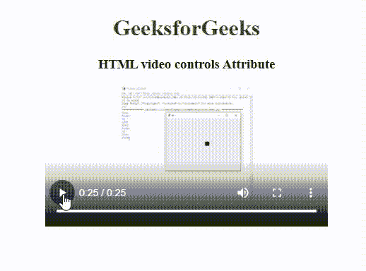
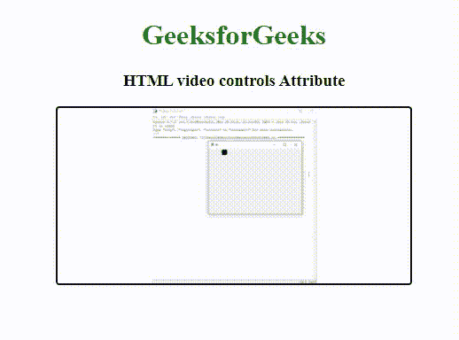

# 如何在 HTML5 中显示视频控件？

> 原文:[https://www . geesforgeks . org/how-display-video-controls-in-html 5/](https://www.geeksforgeeks.org/how-to-display-video-controls-in-html5/)

HTML strong <视频> 控件属性用于在 HTML5 中显示视频控件。它是布尔值。HTML5 最常用 ogg、mp4、ogm 和 ogv 作为视频标签中的视频格式，因为浏览器对它们的支持不同。

**语法**

```html
<video controls>
  <source>
</video>
```

从上面的语法*控件*属性添加了音量、暂停和播放等视频控件，并且 *<源>* 元素允许您指定替代视频文件。视频控制应包括:

*   玩
*   中止
*   卷
*   全屏模式
*   寻找
*   字幕/字幕(如果有)
*   轨道(如果可用)

**属性:**视频标签主要支持如下 5 个属性:

1.  **自动播放**:使视频自动开始播放，无需等待整个视频文件下载完成。
2.  **循环:**通过循环可以反复播放视频。
3.  **静音:**使播放器默认静音。
4.  **预载:**这可以设置为以下值。
    *   **auto :** 这意味着是否应该在页面加载后立即加载视频。
    *   **元数据:**这意味着是否应该只加载视频元数据。
    *   **无:**这意味着当页面加载时，浏览器不应该加载视频。
5.  **src :** 这定义了视频标签应该播放的视频的 URL。

**注意:**一定要指定视频的宽度和高度，否则网页会因为网页变慢的原因而混淆视频需要多少空间。

**示例 1:** 使用下面代码中的 *src* 属性。

## 超文本标记语言

```html
<!DOCTYPE html>
<html>

<body>
    <center>
        <h1 style="color:green;">GeeksforGeeks</h1>

        <h3>HTML video controls Attribute</h3>

        <video width="400" height="200" controls> 
            <source src= 
"https://media.geeksforgeeks.org/wp-content/uploads/20190616234019/Canvas.move_.mp4"
                                type="video/mp4"> 
            <source src= 
"https://media.geeksforgeeks.org/wp-content/uploads/20190616234019/Canvas.move_.ogg"
                                type="video/ogg"> 
        </video>
    </center>
</body>

</html>
```

**输出:**



**例 2:** 使用**自动播放**属性自动播放视频。

## 超文本标记语言

```html
<!DOCTYPE html>
<html>

<body>
    <center>
        <h1 style="color:green;">GeeksforGeeks</h1>

        <h3>HTML video controls Attribute</h3>

        <video width="400" height="200" autoplay controls> 
            <source src= 
"https://media.geeksforgeeks.org/wp-content/uploads/20190616234019/Canvas.move_.mp4"
                                type="video/mp4"> 
            <source src= 
"https://media.geeksforgeeks.org/wp-content/uploads/20190616234019/Canvas.move_.ogg"
                                type="video/ogg"> 
        </video>
    </center>
</body>

</html>
```

**输出:**



**示例 3:** [**海报属性**](https://www.geeksforgeeks.org/html-video-poster-attribute/) 用于视频下载时或用户点击播放按钮时显示图像。

## 超文本标记语言

```html
<!DOCTYPE html>
<html>
<body>
    <center>
        <h1 style="color:green;">GeeksforGeeks</h1>

        <h3>HTML video poster Attribute</h3>

        <video width="400" height="200" controls poster=
 "https://media.geeksforgeeks.org/wp-content/uploads/20190627130930/a218.png"> 
            <source src= 
"https://media.geeksforgeeks.org/wp-content/uploads/20190616234019/Canvas.move_.mp4"
                                                            type="video/mp4"> 
            <source src= 
"https://media.geeksforgeeks.org/wp-content/uploads/20190616234019/Canvas.move_.ogg"
                                                            type="video/ogg"> 
        </video>
    </center>
</body>

</html>
```

**输出:**


**支持的浏览器:****HTML 视频标签**支持的浏览器如下:

*   谷歌 Chrome 4.0
*   Firefox 4.0
*   苹果 Safari 4.0
*   歌剧 10.5