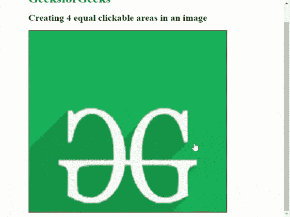

# 如何用 HTML 将一张图片分割成不同的可点击链接区域？

> 原文:[https://www . geesforgeks . org/如何使用 html 将图像分成不同的可点击链接区域/](https://www.geeksforgeeks.org/how-to-divide-an-image-into-different-clickable-link-area-using-html/)

可以使用和[**图像图**](https://www.geeksforgeeks.org/es6-image-map/) **将*图像划分为不同的可点击和可链接区域。***影像地图用于导航目的。

图像地图由几个标签组成:

*   **img:** 指定要包含在地图中的图像。
*   **地图:**创建可点击区域的地图。
*   **区域:**用于地图元素内部定义可点击区域。

我们可以将*区域*做成以下形状:

*   **圆形:**圆形区域
*   **矩形区域**
*   **多边形:**多边形区域
*   **默认:**任何已定义形状之外的区域

**示例:**

```html
 

<map name="map-rect"> 
    <area shape="rect" coords="18,26,220,226" 
        href="https://www.geeksforgeeks.org"/> 
</map>
```

**HTML 代码:**在下面的例子中，我们将使用这个 ***矩形*** 形状作为我们可以很容易地将这个矩形分成四个相等的部分。*坐标*属性的前两个值是*左上角*的(x，y)坐标。第三和第四个数字是*右下角*的(x，y)坐标。

**注:**(x，y)坐标以左上角为原点(0，0)。

## 超文本标记语言

```html
<!DOCTYPE html>
<html>

<head>   
    <style>
        img {
            width: 500px;
            height: 500px;
            border: 1px red solid;
        }

        h1 {
            color: Green;
        }

        body {
            background: white;
            margin-top: 4%;
            margin-left: 10%;
        }
    </style>
</head>

<body>
    <h1>GeeksforGeeks</h1>
    <h2>Creating 4 equal clickable areas in an image</h2>
    
    <map name="gfg_map">
        <!-- dividing rectangle into 4 equal parts -->
         <area shape="rect" coords="0,0, 250,250" alt="GFG1"
            href="https://www.google.co.in"  target="_blank"/>
         <area shape="rect" coords="250,0, 500,250" alt="GFG2"
            href="https://www.geeksforgeeks.org" target="_blank"/>
         <area shape="rect" coords="0,250, 250,500" alt="GFG3"
            href="https://github.com" target="_blank"/>
          <area shape="rect" coords="250,250, 500,500" alt="GFG4"
            href="https://duckduckgo.com" target="_blank"/>
      </map>
</body>

</html>
```

**输出:**

