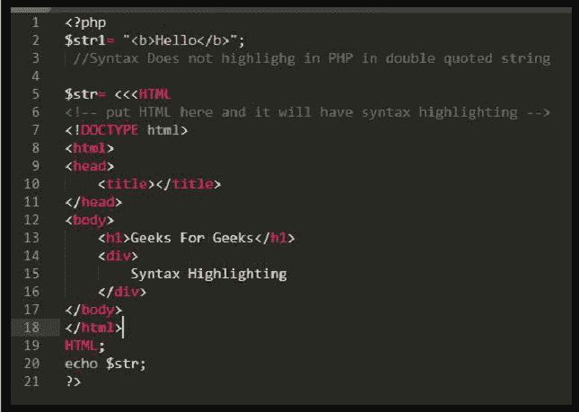
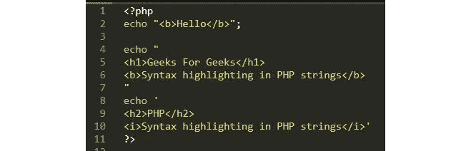
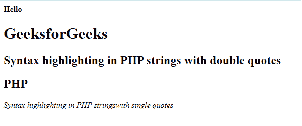
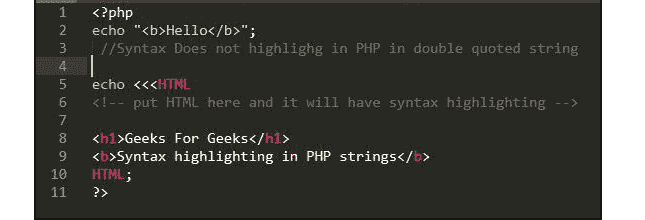
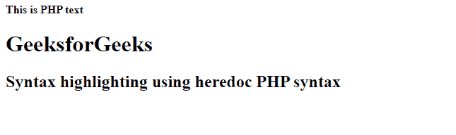
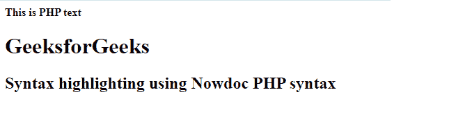

# 如何在 PHP 字符串内部做 HTML 语法高亮？

> 原文:[https://www . geesforgeks . org/how-do-html-语法-突出显示-php-strings/](https://www.geeksforgeeks.org/how-to-do-html-syntax-highlighting-inside-php-strings/)

语法突出显示是代码编辑器的工作，如崇高文本、Visual Studio、Dev CPP 等，它们根据源代码的语法通过颜色、修改的字体或通过图形更改来突出显示源代码的所有不同部分。因为现在颜色突出显示已经集成到所有常见的编辑器和开发区域中。突出显示不会影响代码性能，但会让开发人员的工作更轻松。语法突出显示提高了开发人员对源代码的可读性。

**示例:**



在上面的例子中，代码是在崇高文本代码编辑器中编写的，它用粉色突出显示 HTML 标签，标签内部的字符串是白色的。这被称为语法突出显示。

[**PHP 字符串**](https://www.geeksforgeeks.org/php-strings/) **:** 字符串可以看作是一个字符流。例如，“G”是字符，“GeeksforGeeks”是字符串。我们已经在 [PHP 数据类型和变量](https://www.geeksforgeeks.org/php-data-types/)一文中学习了字符串数据类型的基础知识。

在 PHP 中有四种创建字符串的方法:

1.  单引号字符串
2.  双引号字符串
3.  埃多克
4.  Nowdoc

**PHP 字符串内部的 HTML 语法高亮显示:**PHP 中的 HTML 语法工作正常。我们将讨论 PHP 语法中的 HTML 语法高亮显示。我们可以使用 Heredoc 语法在 PHP 中突出显示 HTML。

PHP 中的 Heredoc 是一种在 PHP 中编写大块字符串的方法，没有经典的单引号、双引号分隔符。它依赖于<<

**语法:**

```html
$string = <<< IdentifierName
// Strings
IdentifierName;
```

**示例 1:**PHP 字符串中 HTML 的语法高亮在单引号或双引号字符串中是不可能的。



单引号和双引号

## 服务器端编程语言（Professional Hypertext Preprocessor 的缩写）

```html
<?php

echo "<b>Hello </b>";

echo "
    <h1>GeeksforGeeks </h1>
    <h2>Syntax highlighting in PHP strings with double quotes</h2>
";

echo '
    <h2>PHP </h2>
    Syntax highlighting  in PHP stringswith single quotes 
';

?>
```

**输出:**



使用单引号和双引号

**示例 2:** 使用 Heredoc 可以在 PHP 字符串中突出显示语法。



埃多克

## 服务器端编程语言（Professional Hypertext Preprocessor 的缩写）

```html
<?php

echo "<b>This is PHP text</b>";

echo <<<HTML

    <!-- Insert your HTML code here -->
    <h1>GeeksforGeeks </h1>
    <h2>Syntax highlighting using heredoc PHP syntax</h2>
HTML; 

?>
```

**注意:**回显< < < HTML 是一个 **heredoc** PHP 语法，它突出了里面的代码直到 HTML。

**输出:**



埃多克

输出与单引号和双引号字符串相同。

**示例 3:** 下面的代码演示了如何使用 Nowdoc 在 PHP 字符串中突出显示语法。

## 服务器端编程语言（Professional Hypertext Preprocessor 的缩写）

```html
<?php

echo "<b>This is PHP text</b>";

echo <<<'EOD'

    <!--Insert your HTML code here -->
    <h1>GeeksforGeeks </h1>
    <h2>Syntax highlighting using Nowdoc PHP syntax</h2>
EOD;      

?>
```

**输出:**



Nowdoc 语法

**参考文献:**T2】https://www.php.net/manual/en/language.types.string.php