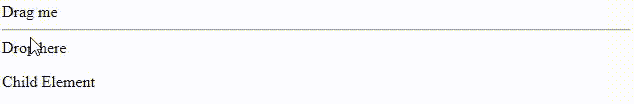
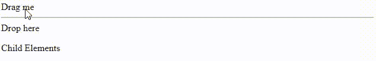

# 如何在 HTML 5 中悬停子元素时触发 dragleave？

> 原文:[https://www . geesforgeks . org/how-drag leave-fired-what-what-what-悬停-a-child-element-in-html-5/](https://www.geeksforgeeks.org/how-to-dragleave-fired-when-hovering-a-child-element-in-html-5/)

当一个 div 可拖动时，我们将鼠标悬停在执行 dragenter 和 dragleave 命令的 div 上，当该 div 内有一个执行 dragleave 命令的子代时，我们会遇到一个问题，如下所示。

**例 1:** 这里当悬停在孩子身上时颜色消失。

## 超文本标记语言

```html
<!DOCTYPE html>
<html lang="en">
  <head>
    <meta charset="UTF-8" />
    <meta http-equiv="X-UA-Compatible" content="IE=edge" />
    <meta name="viewport" 
          content="width=device-width, initial-scale=1.0" />
    <script src=
"https://ajax.googleapis.com/ajax/libs/jquery/3.5.1/jquery.min.js">
    </script>
  </head>
  <style>
    .yellow {
      background-color: yellow;
    }
  </style>
  <body>
    <div id="drag" draggable="true">Drag me</div>
    <hr />

    <div id="drop">
      Drop here

      <p>Child Element</p>
    </div>
    <script>
      $("#drop").bind({
        dragenter: function () {
          $(this).addClass("yellow");
        },

        dragleave: function () {
          $(this).removeClass("yellow");
        },
      });

      $("#drag").bind({
        dragstart: function (e) {
          e.allowedEffect = "copy";
          e.setData("text/plain", "test");
        },
      });
    </script>
  </body>
</html>
```

**输出:**我们可以看到，当悬停在子元素上时，dragleave 函数执行，因此颜色消失。



**示例 2:** 为了克服这个问题，我们使用了一个计数器，该计数器仅在计数器变为零时执行 dragleave 函数。这里当悬停在子颜色上时不会消失

## java 描述语言

```html
<!DOCTYPE html>
<html lang="en">
  <head>
    <meta charset="UTF-8" />
    <meta http-equiv="X-UA-Compatible" content="IE=edge" />
    <meta name="viewport"
          content="width=device-width, initial-scale=1.0" />
    <script src=
"https://ajax.googleapis.com/ajax/libs/jquery/3.5.1/jquery.min.js">
    </script>

  </head>
  <style>
    .yellow {
      background-color: yellow;
    }
  </style>
  <body>
    <div id="drag" draggable="true">Drag me</div>
    <hr />

    <div id="drop">
      Drop here

      <p>Child Elements</p>
    </div>
    <script>
      var counter = 0;

      $("#drop").bind({
        dragenter: function (ev) {
          ev.preventDefault();
          counter++;
          $(this).addClass("yellow");
        },

        dragleave: function () {
          counter--;
          if (counter === 0) {
            $(this).removeClass("yellow");
          }
        },
      });

      $("#drag").bind({
        dragstart: function (e) {
          e.allowedEffect = "copy";
          e.setData("text/plain", "test");
        },
      });
    </script>
  </body>
</html>
```

**输出:**

