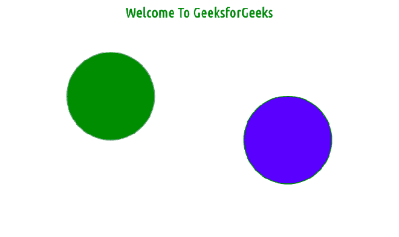
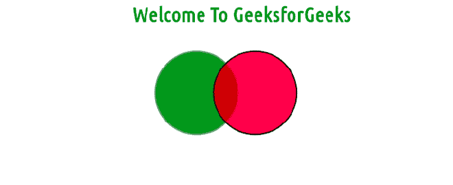

# 如何在 HTML 中使用 SVG 标签画圆？

> 原文:[https://www . geesforgeks . org/如何使用-svg-tag-in-html 绘制圆/](https://www.geeksforgeeks.org/how-to-draw-a-circle-using-svg-tag-in-html/)

在本文中，您将了解到 [SVG 的基本](https://www.geeksforgeeks.org/html-svg-basics/)形状像**圆**，这是 SVG 的不同形状中像 [**<矩形**](https://www.google.com/url?sa=t&rct=j&q=&esrc=s&source=web&cd=&cad=rja&uact=8&ved=2ahUKEwjpweD-36byAhUZcCsKHSrQCR8QFnoECAQQAQ&url=https%3A%2F%2Fwww.geeksforgeeks.org%2Fhtml-svg-rect%2F&usg=AOvVaw2LrWvtCCLMRByj5WThTnDw)**>**[**<线>**](https://www.google.com/url?sa=t&rct=j&q=&esrc=s&source=web&cd=&cad=rja&uact=8&ved=2ahUKEwjpweD-36byAhUZcCsKHSrQCR8QFnoECAQQAQ&url=https%3A%2F%2Fwww.geeksforgeeks.org%2Fhtml-svg-rect%2F&usg=AOvVaw2LrWvtCCLMRByj5WThTnDw)**[**<椭圆>**](https://www.google.com/url?sa=t&rct=j&q=&esrc=s&source=web&cd=&cad=rja&uact=8&ved=2ahUKEwimhNuS4KbyAhVQWysKHVhBDL4QFnoECAMQAQ&url=https%3A%2F%2Fwww.geeksforgeeks.org%2Fhtml-svg-ellipse%2F&usg=AOvVaw2EnguquVQp76lBzP7USS97)**[<所以使用](https://www.google.com/url?sa=t&rct=j&q=&esrc=s&source=web&cd=&cad=rja&uact=8&ved=2ahUKEwjl2Oeb4KbyAhXGfX0KHYxDDZAQFnoECAUQAQ&url=https%3A%2F%2Fwww.geeksforgeeks.org%2Fsvg-polygon-element%2F&usg=AOvVaw1yXYfs1g_ADbFm74byGxXo) [**<画圆>**](https://www.geeksforgeeks.org/svg-circle/) 标签就可以轻松画圆，标签的父标签是 HTML 中的 SVG 标签。****

****基本上，<circle>元素在屏幕上画一个圆，这个圆是由 3 个基本参数完成的，包括 **cx，cy，**和 **r** ，这将在本文中进一步简要说明。</circle>****

******语法:******

```html
**<circle
  cx="x-axis co-ordinate"
  cy="y-axis co-ordinate"
  r="length" >  
</circle>**
```

******属性:******

*   ******cx:** 圆心的 x 轴坐标。默认值为 0。****
*   ******cy:** 圆心的 y 轴坐标。默认值为 0。****
*   ******r:** 圆的半径。****

******注:CX****cy**为确定圆的位置的 x 轴和 y 轴坐标，r 为确定圆的**尺寸**的圆半径。如果圆的半径为零，则圆渲染将被禁用。****

******例 1:******

## ****超文本标记语言****

```html
**<!DOCTYPE html>
<html>
   <body>
      <center>
         <h1 style="color:green">Welcome To GeeksforGeeks</h1>
         <svg height="400" width="400">
            <circle cx="150" cy="150" r="100" stroke="gray" 
               stroke-width="2" fill="green" />
         </svg>
         <svg height="300" width="300">
            <circle cx="150" cy="150" r="100" stroke="green" 
               stroke-width="2" fill="blue" />
         </svg>
      </center>
   </body>
</html>**
```

******输出:******

********

******例 2:******

## ****超文本标记语言****

```html
**<!DOCTYPE html>
<html>
   <body>
      <center>
         <h1 style="color:green">Welcome To GeeksforGeeks</h1>
         <svg xmlns="http://www.w3.org/2000/svg"
            xmlns:xlink="http://www.w3.org/1999/xlink">
            <!-green circle is towards 80px +ve x-axis with 64px radius->
            <circle cx="80" cy="80" r="64"
               stroke="gray" stroke-width="2" 
               fill="green"  fill-opacity="90%" />
            <!-red circle is towards 170px  +ve x-axis with 64px radius->
            <circle cx="170" cy="80" r="64"
               stroke="black" stroke-width="2" fill="red"
               fill-opacity="70%" />
         </svg>
      </center>
   </body>
</html>**
```

******输出:******

********