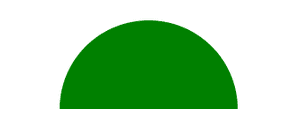

# 如何用 HTML 和 CSS 绘制半圆？

> 原文:[https://www . geeksforgeeks . org/如何使用 html 和 css 绘制半圆/](https://www.geeksforgeeks.org/how-to-draw-a-semi-circle-using-html-and-css/)

使用 HTML 和 CSS 可以很容易地创建半圆或半圆形状。我们将使用*边界半径*属性来绘制所需的输出。

**HTML 代码:**在本节中，我们将使用*<>*标签创建一个简单的“div”元素。

## 超文本标记语言

```html
<!DOCTYPE html>
<html lang="en">

<head>
    <meta charset="UTF-8">
    <meta name="viewport" content=
        "width=device-width, initial-scale=1.0">
    <title>Semi Circle</title>
</head>

<body>
    <div></div>
</body>

</html>
```

**CSS 代码:**在本节中，我们将首先使用简单的 CSS 属性设计“div”框，然后使用*边框半径*属性绘制半圆。

## 半铸钢ˌ钢性铸铁(Cast Semi-Steel)

```html
<style>
    * {
        margin: 0;
        padding: 0;
        background-color: white;

    }

    /* Using the "border-radius" property
       to draw the semi-circle*/

    div {
        position: absolute;
        top: 50%;
        left: 50%;
        transform: translate(-50%, -50%);
        height: 100px;
        width: 200px;
        border-radius: 150px 150px 0 0;
        background-color: green;
    }
</style>
```

**最终代码:**是以上两个代码段的组合。

## 超文本标记语言

```html
<!DOCTYPE html>
<html lang="en">

<head>
    <meta charset="UTF-8">
    <meta name="viewport" content=
        "width=device-width, initial-scale=1.0">

    <title>Semi Circle</title>

    <style>
        * {
            margin: 0;
            padding: 0;
            background-color: white;

        }

        /* Using the border-radius property 
           to draw the semi-circle*/
        div {
            position: absolute;
            top: 50%;
            left: 50%;
            transform: translate(-50%, -50%);
            height: 100px;
            width: 200px;
            border-radius: 150px 150px 0 0;
            background-color: green;
        }
    </style>
</head>

<body>
    <div></div>
</body>

</html>
```

**输出:**



CSS 是网页的基础，通过设计网站和网络应用程序用于网页开发。你可以通过以下 [CSS 教程](https://www.geeksforgeeks.org/css-tutorials/)和 [CSS 示例](https://www.geeksforgeeks.org/css-examples/)从头开始学习 CSS。