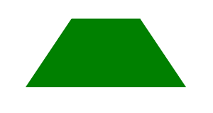

# 如何用 HTML 和 CSS 绘制梯形？

> 原文:[https://www . geeksforgeeks . org/如何使用 html 和 css 绘制梯形图/](https://www.geeksforgeeks.org/how-to-draw-a-trapezium-using-html-and-css/)

A **梯形**是有两条平行边和两条不平行边的四边形。在本文中，我们将使用简单的 HTML 和 CSS 创建一个**梯形**形状。

**HTML 代码:**在本节中，我们将使用 HTML i div 标签创建一个简单的元素。

## 超文本标记语言

```html
<!DOCTYPE html>
<html lang="en">
<head>
  <meta charset="UTF-8">
  <meta name="viewport" content=
    "width=device-width, initial-scale=1.0">
  <title>Trapezium</title>
</head>

<body>
  <div class="trapezium"></div>  
</body>
</html>
```

**CSS 代码:**在本节中，我们将首先使用一些基本的 CSS 属性来设计 *div* 元素，然后使用*边框-底部、边框-左侧*和**边框-右侧**属性来创建梯形形状。

## 钢性铸铁

```html
<style>
  /* creating the trapezium shape*/
  .trapezium {
     height: 0;
     width: 150px;
     border-bottom: 150px solid green;
     border-left: 100px solid transparent;
     border-right: 100px solid transparent;
  }
</style>
```

**最终代码:**是以上两个代码段的组合。

## 超文本标记语言

```html
<!DOCTYPE html>
<html lang="en">

<head>
  <meta charset="UTF-8">
  <meta name="viewport" content=
    "width=device-width, initial-scale=1.0">
  <title>Trapezium</title>

  <style>

    /* Creating the trapezium shape*/
    .trapezium {
      height: 0;
      width: 150px;
      border-bottom: 150px solid green;
      border-left: 100px solid transparent;
      border-right: 100px solid transparent;
    }
  </style>
</head>

<body>
  <div class="trapezium"></div>
</body>

</html>
```

**输出:**

