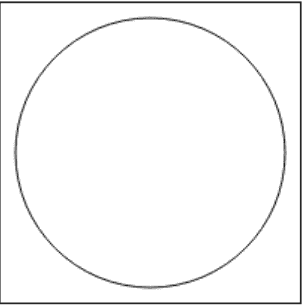

# 如何在 HTML5 中使用 Canvas 绘制图形？

> 原文:[https://www . geesforgeks . org/如何使用 html5 中的画布绘制图形/](https://www.geeksforgeeks.org/how-to-draw-graphics-using-canvas-in-html5/)

在本文中，我们将使用文档中的**画布**元素来绘制图形。HTML 中的这个标记用于使用 JavaScript 在网页上绘制图形。它可以用来绘制路径、方框、文本、渐变和添加图像。默认情况下，它不包含边框和文本。

**注意:**这个标签在 HTML5 中是新的。

**语法:**

```html
<canvas id = "script"> Contents... </canvas>
```

**例 1:**

```html
<!DOCTYPE html>
<html>

<head>
    <meta charset="utf-8">
    <title>
        How to Draw Graphics using
        Canvas in HTML5 ?
    </title>

    <style>
        #FirstCanvas {
            width: 300px;
            height: 300px;
            border: 3px solid red;
            background-color: blue;
        }
    </style>
</head>

<body>
    <canvas id="FirstCanvas"></canvas>
</body>

</html>
```

**输出:** 

**例 2:**

```html
<!DOCTYPE html>
<html>

<head>
    <title>
        How to Draw Graphics 
        using Canvas in HTML5?
    </title>
</head>

<body>
    <canvas id="geeks" height="200"
            width="200" style=
            "border:1px solid black">
    </canvas>

    <script>
        var c = document.getElementById("geeks");
        var cx = c.getContext("2d");
        cx.beginPath();
        cx.arc(100, 100, 90, 0, 2 * Math.PI);
        cx.stroke(); 
    </script>
</body>

</html>
```

**输出:**


**支持的浏览器:**

*   谷歌 Chrome
*   微软公司出品的 web 浏览器
*   火狐浏览器
*   歌剧
*   旅行队