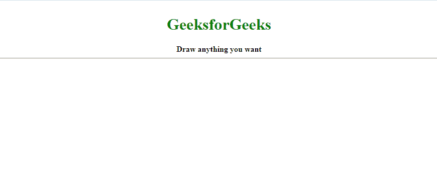
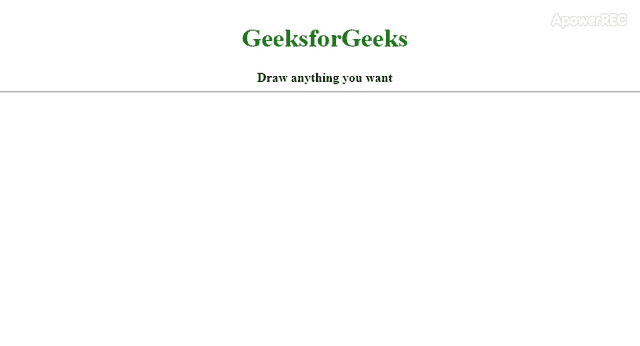

# 如何在 HTML 5 画布中用鼠标进行绘制？

> 原文:[https://www . geesforgeks . org/如何用鼠标在 html-5-canvas 中绘图/](https://www.geeksforgeeks.org/how-to-draw-with-mouse-in-html-5-canvas/)



在本文中，我们将探索在 HTML 5 画布上用鼠标指针进行绘制的几种方法。HTML 画布本质上是各种图形元素的容器，如正方形、矩形、弧形、图像等。它让我们可以灵活地控制画布内图形元素的动画。然而，画布的功能必须通过 JavaScript 添加。

在下面的过程中，我们将使用一个**标志变量**来切换与**鼠标事件**相关的绘图开和关。我们将在 JavaScript 中收听**鼠标向下**、**鼠标向上**和**鼠标移动**事件。

默认情况下，画布元素有一些属性，如填充等。(可以更改样式)。因此，属性 **[偏移](https://www.geeksforgeeks.org/html-dom-offsettop-property/)** 和 **[偏移](https://www.geeksforgeeks.org/html-dom-offsetleft-property/)** 用于检索画布相对于其**偏移父元素**(DOM 中画布的最近祖先元素)的位置。通过从 event.clientX 和 event.clientY 中减去这些值，我们可以将**绘图的起点重新定位到光标**的顶端。在函数草图()中，我们使用以下内置方法来添加功能。

*   **[beginPath()](https://www.geeksforgeeks.org/html-canvas-beginpath-method/) :** 开始新路径，每次点击鼠标左键。
*   **[线宽](https://www.geeksforgeeks.org/html-canvas-linewidth-property/) :** 设置将要绘制的线的宽度。
*   **[strokeStyle](https://www.geeksforgeeks.org/html-canvas-strokestyle-property/) :** 在这方面，我们用它来设置线条的颜色为黑色。可以更改该属性以产生不同颜色的线条。
*   **[moveTo()](https://www.geeksforgeeks.org/html-canvas-moveto-method/) :** 路径的起始位置移动到画布上的指定坐标。
*   **[【line to()](https://www.geeksforgeeks.org/html-canvas-lineto-method/):**创建从所述位置到指定坐标的直线。
*   **[描边()](https://www.geeksforgeeks.org/html-canvas-stroke-method/) :** 为创建的线条添加描边。没有这个，线就看不见了。

*   **创建画布元素:**

    ```html
    <!DOCTYPE html>
    <html lang="en">
    <head>
        <meta charset="UTF-8">
        <meta name="viewport" content=
                "width=device-width, initial-scale=1.0">

        <title>
            Draw with the mouse in a HTML5 canvas
        </title>

        <style>
            * {
                overflow: hidden;
            }
            body {
                text-align: center;
            }
            h1 {
                color: green;
            }
        </style>
    </head>

    <body>
        <h1>GeeksforGeeks</h1>
        <b>Draw anything you want</b>
        <hr>
        <canvas id="canvas"></canvas>
        <script src="index.js"></script>
    </body>

    </html>
    ```

*   **制作交互式画布的 JavaScript 代码:**

    ```html
    // wait for the content of the window element
    // to load, then performs the operations.
    // This is considered best practice.
    window.addEventListener('load', ()=>{

        resize(); // Resizes the canvas once the window loads
        document.addEventListener('mousedown', startPainting);
        document.addEventListener('mouseup', stopPainting);
        document.addEventListener('mousemove', sketch);
        window.addEventListener('resize', resize);
    });

    const canvas = document.querySelector('#canvas');

    // Context for the canvas for 2 dimensional operations
    const ctx = canvas.getContext('2d');

    // Resizes the canvas to the available size of the window.
    function resize(){
      ctx.canvas.width = window.innerWidth;
      ctx.canvas.height = window.innerHeight;
    }

    // Stores the initial position of the cursor
    let coord = {x:0 , y:0}; 

    // This is the flag that we are going to use to 
    // trigger drawing
    let paint = false;

    // Updates the coordianates of the cursor when 
    // an event e is triggered to the coordinates where 
    // the said event is triggered.
    function getPosition(event){
      coord.x = event.clientX - canvas.offsetLeft;
      coord.y = event.clientY - canvas.offsetTop;
    }

    // The following functions toggle the flag to start
    // and stop drawing
    function startPainting(event){
      paint = true;
      getPosition(event);
    }
    function stopPainting(){
      paint = false;
    }

    function sketch(event){
      if (!paint) return;
      ctx.beginPath();

      ctx.lineWidth = 5;

      // Sets the end of the lines drawn
      // to a round shape.
      ctx.lineCap = 'round';

      ctx.strokeStyle = 'green';

      // The cursor to start drawing
      // moves to this coordinate
      ctx.moveTo(coord.x, coord.y);

      // The position of the cursor
      // gets updated as we move the
      // mouse around.
      getPosition(event);

      // A line is traced from start
      // coordinate to this coordinate
      ctx.lineTo(coord.x , coord.y);

      // Draws the line.
      ctx.stroke();
    }
    ```

*   **输出:**功能**草图()**只有在**标志的值为真**时才会执行。在 **beginPath()** 之后更新存储在对象坐标中的坐标很重要，因此调用 **getPosition(事件)**。将 JavaScript 文件链接到 HTML 文件后，将获得以下代码。
    