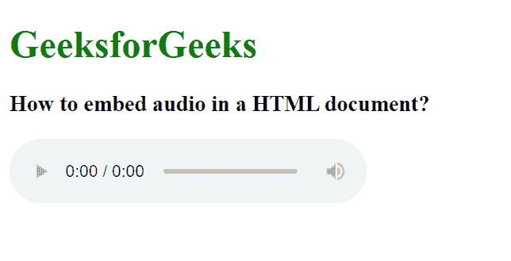

# 如何在 HTML 文档中嵌入音频元素？

> 原文:[https://www . geesforgeks . org/如何在 html 文档中嵌入音频元素/](https://www.geeksforgeeks.org/how-to-embed-audio-element-in-a-html-document/)

自 HTML5 发布以来，可以使用

<audio>标签向网页添加音频。以前，音频只能在网页上使用网页插件(如 Flash)播放。

<audio>标签是一个内嵌元素，用于将声音文件嵌入到网页中。如果您想在网页上添加歌曲、采访等音频，这是一个非常有用的标签。</audio>

</audio>

**语法:**

```html
<audio>
    <source src="sample.mp3" type="audio/mpeg">
</audio>

```

**例 1:**

## 超文本标记语言

```html
<!DOCTYPE html>
<html>

<body>
    <h1 style="color:green;">
        GeeksforGeeks
    </h1>

    <h3>
        How to embed audio in a HTML document?
    </h3>

    <audio controls>
        <source src="test.mp3" type="audio/mp3">
        <source src="test.ogg" type="audio/ogg">
    </audio>

</body>

</html>
```

**输出:**



**示例 2:** 在本例中，加载网页后，音频会自动播放。

## 超文本标记语言

```html
<!DOCTYPE html>
<html>

<body>
    <h1 style="color:green;">
        GeeksforGeeks
    </h1>

    <h3>
        How to embed audio in a HTML document?
    </h3>

    <audio controls autoplay>
        <source src="test.mp3" type="audio/mp3">
        <source src="test.ogg" type="audio/ogg">
    </audio>

</body>

</html>
```

**输出:**

