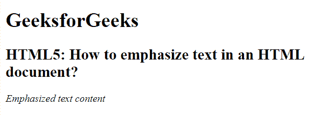
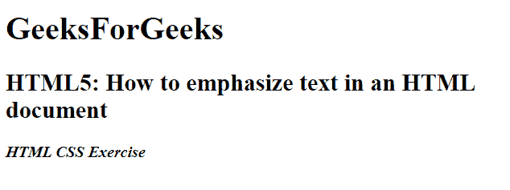

# 如何用 HTML5 强调文档中的文字？

> 原文:[https://www . geesforgeks . org/如何使用-html5 强调文档中的文本/](https://www.geeksforgeeks.org/how-to-emphasize-text-in-a-document-using-html5/)

在本文中，我们将通过使用文档中的 **[< em >元素](https://www.geeksforgeeks.org/html-em-tag/)** 来强调 HTML 文档中的文本。它是一个短语标签，用于强调文本内容。

**语法:**

```html
<em> Contents... </em>
```

**例 1:**

```html
<!DOCTYPE html>
<html>

<head>
    <title>
        Emphasize text in 
        an HTML document
    </title>
</head>

<body>
    <h1>GeeksforGeeks</h1>

    <h2>
        HTML5: How to emphasize
        text in an HTML document?
    </h2>

    <em>Emphasized text content</em>
</body>

</html>
```

**输出:**


**例 2:**

```html
<!DOCTYPE html>
<html>

<head>
    <meta http-equiv="Content-Type"
        content="text/html; 
        charset=iso-8859-1">

    <title>
        HTML5: How to emphasize
        text in an HTML document?
    </title>
</head>

<body>
    <h1>GeeksForGeeks</h1>

    <h2>
        HTML5: How to emphasize 
        text in an HTML document
    </h2>

    <strong>
        <em>HTML CSS Exercise</em>
    </strong>
</body>

</html>
```

**输出:**


**支持的浏览器:**

*   谷歌 Chrome
*   微软公司出品的 web 浏览器
*   火狐浏览器
*   歌剧
*   旅行队