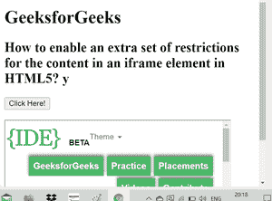

# 如何在 HTML5 中为 iframe 元素中的内容启用额外的限制集？

> 原文:[https://www . geesforgeks . org/如何启用 html5 中 iframe 元素内容的额外限制集/](https://www.geeksforgeeks.org/how-to-enable-extra-set-of-restrictions-for-content-in-an-iframe-element-in-html5/)

**方法:**本文的方法是学习如何在 HTML5 中为 iframe 元素中的内容启用一组额外的限制。可以使用 **< iframe >元素的**沙盒**属性来完成任务。**用于允许对 iframe 中的内容附加一组限制。

沙盒属性的值要么是简单的沙盒(然后应用所有限制)，要么是一个用空格分隔的预定义值列表，它将带走实际的限制。

以下是沙盒属性具有的预定义值列表–

*   **无值:**适用所有限制。
*   **允许-表单:**重新启用表单提交。
*   **允许指针锁定:**重新启用应用编程接口。
*   **允许弹出:**重新启用弹出。
*   **允许同源:**允许将 iframe 的内容视为同源。
*   **允许-脚本:**重新启用脚本。
*   **允许顶级导航:**允许 iframe 的内容导航其顶级浏览上下文。

**语法:**

```html
<iframe sandbox="value">
```

**示例:**

## 超文本标记语言

```html
<!DOCTYPE html>
<html>

<body>
    <h1>GeeksforGeeks</h1>

    <h2>
        How to enable an extra set of
        restrictions for the content in
        an iframe element in HTML5?
    </h2>

    <button onclick="myGeeks()">
        Click Here!
    </button>
    <br><br>

    <iframe id="GFGFrame" src=
"https://ide.geeksforgeeks.org/tryit.php" 
        width="400" height="200" sandbox>
    </iframe>
</body>

</html>
```

**输出:**

