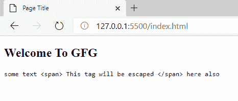
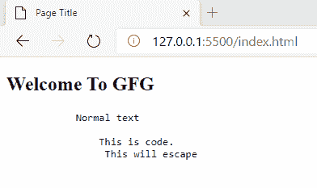

# 如何在 HTML 中转义一个块中的所有内容？

> 原文:[https://www . geesforgeks . org/how-to-escape-in-a-block-in-html/](https://www.geeksforgeeks.org/how-to-escape-everything-in-a-block-in-html/)

转义是一种方法，它允许我们通知计算机尝试用我们提供的文本做一些特殊的事情，或者忽略元素的特殊功能。HTML 中有一些标签，可以帮助我们转义完整的文本，并按照 HTML 源代码中的原样显示给网站。

**方法 1:** 使用< xmp >标签(已弃用)

## 超文本标记语言

```html
<!DOCTYPE html>
<html>
    <body>
        <h2>Welcome To GFG</h2>
        <xmp>some text 
          <span> This tag will be escaped </span> 
          here also
        </xmp>
    </body>
</html>
```

**输出:**



**方法 2:** 使用<前置>标签

## 超文本标记语言

```html
<!DOCTYPE html>
<html>
    <body>
        <h2>Welcome To GFG</h2>
        <pre>
            Normal text
            <code>
                This is code.
                <span> This will escape </span>
            </code>
        </pre>
    </body>
</html>
```

**输出:**

