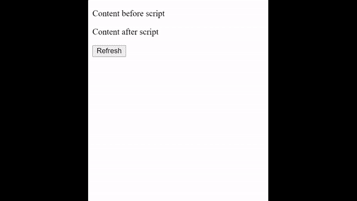
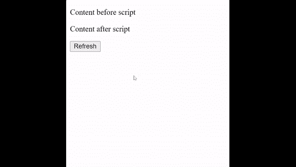

# 如何在 HTML5 中异步执行一个脚本？

> 原文:[https://www . geesforgeks . org/如何异步执行脚本 html5/](https://www.geeksforgeeks.org/how-to-execute-a-script-asynchronously-in-html5/)

在本文中，我们将学习如何在网页上异步执行脚本。这可以在加载内容很重要的情况下使用，因为繁重的脚本会导致页面等待加载，从而使页面看起来不完整。异步加载将解决阻止 DOM 呈现的问题。

脚本标签用于在网页内部实现外部和外部脚本。为了让脚本异步运行，我们有两个属性，第一个是**异步**，第二个是**延迟**。这些都是布尔类型的属性，两者都异步加载脚本，而不会阻塞 DOM 呈现。

两者的主要区别是 *async* 属性在加载后不等待 DOM 完成渲染就异步执行脚本，而 delay 属性在 DOM 内容完全加载后执行脚本。旧版浏览器不支持*异步*属性，但旧版浏览器支持*延迟*。

当*异步*和*延迟*都被使用时，*延迟*属性被浏览器忽略。但是，如果浏览器是旧的并且不支持*异步*，那么*延迟*属性将会起作用。

**示例 1:** 在这个示例中，我们有四个元素，第一个是一个< p >元素，它是脚本之前的内容，第二个是<脚本>元素，它包含要加载的脚本，第三个是另一个< p >元素，它是脚本之后的内容，第四个是<按钮>元素来刷新页面。我们将异步加载脚本，并将脚本放在代码中间，看看它是否阻止了 DOM 呈现。

## 超文本标记语言

```html
<html>
  <body>
    <p>Content before script</p>
    <script async
      src=
"https://ajax.googleapis.com/ajax/libs/jquery/3.5.1/jquery.min.js">
    </script>

    <p>Content after script</p>
    <button onclick="window.location.reload()">
      Refresh
    </button>
  </body>
</html>
```

**输出:**

*   在不使用异步属性的情况下，第二个

    元素会在一段时间后加载:

    

*   使用异步属性，脚本异步加载，而不阻塞 DOM 呈现

    

**示例 2:** 这个示例与上一个示例相同，但是我们使用的是*延迟*而不是*异步*。在这种情况下，脚本在所有 DOM 内容被呈现后被加载。

## 超文本标记语言

```html
<html>
<body>
<p>Content before script</p>

    <script defer src=
"https://ajax.googleapis.com/ajax/libs/jquery/3.5.1/jquery.min.js">
    </script>
    <p>Content after script</p>
    <button onclick="window.location.reload()">
      Refresh
    </button>
</body>
</html>
```

**输出:**

*   在不使用延迟属性的情况下，第二个

    元素会在一段时间后加载:

    

*   使用延迟属性，脚本在 DOM 呈现完成后加载:

    