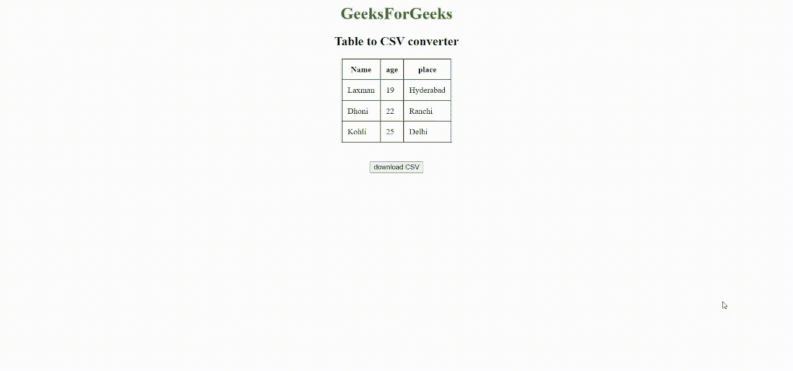

# 如何使用 JavaScript 将 HTML 表格导出到 CSV？

> 原文:[https://www . geesforgeks . org/how-export-html-table-to-CSV-using-JavaScript/](https://www.geeksforgeeks.org/how-to-export-html-table-to-csv-using-javascript/)

**逗号分隔值**或 CSV 是一种文本文件，其中每个值都由逗号分隔。CSV 文件对于将数据导入和导出到其他软件应用程序非常有用。

有时在开发 web 应用程序时，您可能会遇到需要下载从 HTML 表转换而来的 CSV 文件的情况。在这篇文章中，让我们讨论如何使用纯 JavaScript 创建这个特性，而不使用任何花哨的插件、模块或框架。

**方法:**创建一个 [HTML 表格](https://www.geeksforgeeks.org/html-tables/)。通过使用 JavaScript 和[文档对象模块(DOM)](https://www.geeksforgeeks.org/dom-document-object-model/) ，我们将提取一行中的每一列数据，并使用逗号组合数据。对每一行都这样做后，再次使用 DOM，我们将创建一个新的下载链接，并使用 [JavaScript 事件侦听器](https://www.geeksforgeeks.org/javascript-addeventlistener-with-examples/)触发该链接来下载数据以形成 CSV 文件。

**第一步:创建一个 HTML 表格:**创建一个带有表格和按钮的简单 HTML 页面。此按钮将用作触发器，将表格转换为逗号分隔值，并以 CSV 文件的形式下载。应用你自己需要的 CSS 样式。

## 超文本标记语言

```html
<!DOCTYPE html>
<html>

<body>
    <center>
        <h1 style="color:green">GeeksForGeeks</h1>
        <h2>Table to CSV converter</h2>
        <table border="1" cellspacing="0" cellpadding="10">
            <tr>
                <th>Name</th>
                <th>age</th>
                <th>place</th>
            </tr>
            <tr>
                <td>Laxman</td>
                <td>19</td>
                <td>Hyderabad</td>
            </tr>
            <tr>
                <td>Dhoni</td>
                <td>22</td>
                <td>Ranchi</td>
            </tr>
            <tr>
                <td>Kohli</td>
                <td>25</td>
                <td>Delhi</td>
            </tr>
        </table>
        <br><br>
        <button type="button">download CSV</button>
    </center>
</body>

</html>
```

**第二步:将表数据转换为逗号分隔值:**编写一个 JavaScript 函数，检索表数据，转换为逗号分隔值。利用文档对象模型来访问行的每一列中的表数据。该功能应在用户点击下载按钮时触发。

## java 描述语言

```html
function tableToCSV() {

    // Variable to store the final csv data
    var csv_data = [];

    // Get each row data
    var rows = document.getElementsByTagName('tr');
    for (var i = 0; i < rows.length; i++) {

        // Get each column data
        var cols = rows[i].querySelectorAll('td,th');

        // Stores each csv row data
        var csvrow = [];
        for (var j = 0; j < cols.length; j++) {

            // Get the text data of each cell of
            // a row and push it to csvrow
            csvrow.push(cols[j].innerHTML);
        }

        // Combine each column value with comma
        csv_data.push(csvrow.join(","));
    }
    // combine each row data with new line character
    csv_data = csv_data.join('\n');

    /* We will use this function later to download
    the data in a csv file downloadCSVFile(csv_data);
    */
}
```

当 *tableToCSV()* 功能被触发时，它使用文档对象模型访问每个表行数据。[**getElementByTagName(' tr ')**](https://www.geeksforgeeks.org/html-dom-getelementsbytagname-method/)检索所有表行数据并将其存储在 row 变量中。[排【I】。querySelectorAll('td，th')](https://www.geeksforgeeks.org/html-dom-queryselectorall-method/) 将获取该表行的每一列数据。然后存储在 *csvrow* 变量中。*csvow*变量数据用逗号组合表示一行 csv 文件，然后存储在 *csv_data* 变量中，该变量组合表示我们 CSV 文件的数据。然后，我们使用换行符连接 *csv_data* 值，因为 csv 文件中的每一行都以新的一行表示。现在我们的数据可以导出到 CSV 文件了。

**第三步:编写脚本下载 CSV 文件:**现在我们已经准备好了转换后的数据，我们需要编写一个脚本来创建一个 CSV 文件，将我们的数据馈送到其中，并在用户单击下载按钮后触发浏览器自动下载。由于表数据转换后会触发这个函数，所以我们在 *tableToCSV()* 函数里面调用这个函数。

## java 描述语言

```html
function downloadCSVFile(csv_data) {

    // Create CSV file object and feed our
    // csv_data into it
    CSVFile = new Blob([csv_data], { type: "text/csv" });

    // Create to temporary link to initiate
    // download process
    var temp_link = document.createElement('a');

    // Download csv file
    temp_link.download = "GfG.csv";
    var url = window.URL.createObjectURL(CSVFile);
    temp_link.href = url;

    // This link should not be displayed
    temp_link.style.display = "none";
    document.body.appendChild(temp_link);

    // Automatically click the link to trigger download
    temp_link.click();
    document.body.removeChild(temp_link);
}
```

这个函数将把前面形成的 CSV 数据作为参数。我们将通过创建一个 CSV 类型的 [blob 对象](https://www.geeksforgeeks.org/javascript-blob/)来创建一个新文件，然后将我们的 CSV 数据输入其中。我们需要一个链接来触发浏览器窗口下载文件。然而，我们的 HTML 中没有任何链接来这样做。因此，我们将使用 DOM 创建一个新的链接，并为其属性提供适当的值。这样创建的链接不应该对用户可见，因为该链接仅用于下载触发目的，而不用于任何其他目的。因此，我们需要确保该链接对用户不可见，并在下载触发过程结束后删除。同样，我们可以使用 DOM 来满足我们的所有需求。

使用 [**点击()**](https://www.geeksforgeeks.org/jquery-click-with-examples/) 事件监听器，我们可以自动让链接被点击并下载我们的 CSV 文件。现在我们的 CSV 文件应该可以成功下载了。

**最终代码:**

## 超文本标记语言

```html
<!DOCTYPE html>
<html>

<body>
    <center>
        <h1 style="color:green">GeeksForGeeks</h1>
        <h2>Table to CSV converter</h2>
        <table border="1" cellspacing="0" cellpadding="10">
            <tr>
                <th>Name</th>
                <th>age</th>
                <th>place</th>
            </tr>
            <tr>
                <td>Laxman</td>
                <td>19</td>
                <td>Hyderabad</td>
            </tr>
            <tr>
                <td>Dhoni</td>
                <td>22</td>
                <td>Ranchi</td>
            </tr>
            <tr>
                <td>Kohli</td>
                <td>25</td>
                <td>Delhi</td>
            </tr>
        </table>
        <br><br>
        <button type="button" onclick="tableToCSV()">
            download CSV
        </button>
    </center>

    <script type="text/javascript">
        function tableToCSV() {

            // Variable to store the final csv data
            var csv_data = [];

            // Get each row data
            var rows = document.getElementsByTagName('tr');
            for (var i = 0; i < rows.length; i++) {

                // Get each column data
                var cols = rows[i].querySelectorAll('td,th');

                // Stores each csv row data
                var csvrow = [];
                for (var j = 0; j < cols.length; j++) {

                    // Get the text data of each cell
                    // of a row and push it to csvrow
                    csvrow.push(cols[j].innerHTML);
                }

                // Combine each column value with comma
                csv_data.push(csvrow.join(","));
            }

            // Combine each row data with new line character
            csv_data = csv_data.join('\n');

            // Call this function to download csv file 
            downloadCSVFile(csv_data);

        }

        function downloadCSVFile(csv_data) {

            // Create CSV file object and feed
            // our csv_data into it
            CSVFile = new Blob([csv_data], {
                type: "text/csv"
            });

            // Create to temporary link to initiate
            // download process
            var temp_link = document.createElement('a');

            // Download csv file
            temp_link.download = "GfG.csv";
            var url = window.URL.createObjectURL(CSVFile);
            temp_link.href = url;

            // This link should not be displayed
            temp_link.style.display = "none";
            document.body.appendChild(temp_link);

            // Automatically click the link to
            // trigger download
            temp_link.click();
            document.body.removeChild(temp_link);
        }
    </script>
</body>

</html>
```

**输出:**



Html 表格到 CSV 文件