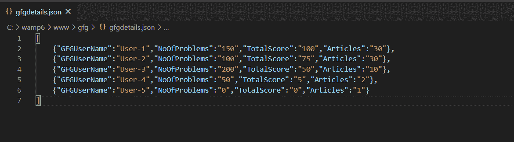
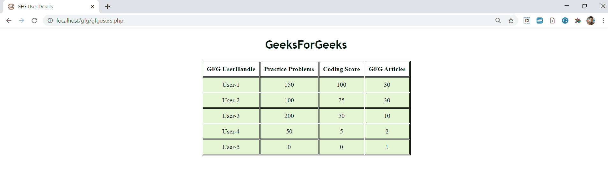

# 如何使用 jQuery 从 JSON 文件中获取数据并显示在 HTML 表格中？

> 原文:[https://www . geesforgeks . org/如何使用-jquery/](https://www.geeksforgeeks.org/how-to-fetch-data-from-json-file-and-display-in-html-table-using-jquery/) 从 JSON-file-in-html-display-table 中获取数据

任务是从给定的 JSON 文件中获取数据，并将数据转换成一个 HTML 表。

**方法:**我们有一个 JSON 文件，包含对象数组形式的数据。在我们的代码中，我们使用 jQuery 来完成我们的任务。jQuery 代码使用 [*getJSON()*](https://www.geeksforgeeks.org/jquery-getjson-method/) 方法，使用 AJAX **HTTP GET** 请求从文件位置获取数据。它需要两个参数。一个是 JSON 文件的位置，另一个是包含 JSON 数据的函数。 [*每个()*](https://www.geeksforgeeks.org/jquery-misc-each-method/) 函数用于迭代数组中的所有对象。它还需要两个参数。一个是数据，另一个是包含索引和元素的函数。空字符串用于构造包含 JSON 对象数据的行。 [*append()*](https://www.geeksforgeeks.org/jquery-append-method/) 方法用于追加表中包含行的字符串。

**JSON 文件:**


**示例:**

```html
<html lang="en">

<head>
    <meta charset="UTF-8">
    <title>GFG User Details</title>

    <!-- INCLUDING JQUERY-->
    <script src=
"https://code.jquery.com/jquery-3.5.1.js">
    </script>

    <!-- CSS FOR STYLING THE PAGE -->
    <style>
        table {
            margin: 0 auto;
            font-size: large;
            border: 1px solid black;
        }

        h1 {
            text-align: center;
            color: #006600;
            font-size: xx-large;
            font-family: 'Gill Sans', 
                'Gill Sans MT', ' Calibri', 
                'Trebuchet MS', 'sans-serif';
        }

        td {
            background-color: #E4F5D4;
            border: 1px solid black;
        }

        th,
        td {
            font-weight: bold;
            border: 1px solid black;
            padding: 10px;
            text-align: center;
        }

        td {
            font-weight: lighter;
        }
    </style>
</head>

<body>
    <section>
        <h1>GeeksForGeeks</h1>

        <!-- TABLE CONSTRUCTION-->
        <table id='table'>
            <!-- HEADING FORMATION -->
            <tr>
                <th>GFG UserHandle</th>
                <th>Practice Problems</th>
                <th>Coding Score</th>
                <th>GFG Articles</th>
            </tr>

            <script>
                $(document).ready(function () {

                    // FETCHING DATA FROM JSON FILE
                    $.getJSON("gfgdetails.json", 
                            function (data) {
                        var student = '';

                        // ITERATING THROUGH OBJECTS
                        $.each(data, function (key, value) {

                            //CONSTRUCTION OF ROWS HAVING
                            // DATA FROM JSON OBJECT
                            student += '<tr>';
                            student += '<td>' + 
                                value.GFGUserName + '</td>';

                            student += '<td>' + 
                                value.NoOfProblems + '</td>';

                            student += '<td>' + 
                                value.TotalScore + '</td>';

                            student += '<td>' + 
                                value.Articles + '</td>';

                            student += '</tr>';
                        });

                        //INSERTING ROWS INTO TABLE 
                        $('#table').append(student);
                    });
                });
            </script>
    </section>
</body>

</html>
```

**输出:**


HTML 是网页的基础，通过构建网站和网络应用程序用于网页开发。您可以通过以下 [HTML 教程](https://www.geeksforgeeks.org/html-tutorials/)和 [HTML 示例](https://www.geeksforgeeks.org/html-examples/)从头开始学习 HTML。

CSS 是网页的基础，通过设计网站和网络应用程序用于网页开发。你可以通过以下 [CSS 教程](https://www.geeksforgeeks.org/css-tutorials/)和 [CSS 示例](https://www.geeksforgeeks.org/css-examples/)从头开始学习 CSS。

jQuery 是一个开源的 JavaScript 库，它简化了 HTML/CSS 文档之间的交互，它以其“少写多做”的理念而闻名。
跟随本 [jQuery 教程](https://www.geeksforgeeks.org/jquery-tutorials/)和 [jQuery 示例](https://www.geeksforgeeks.org/jquery-examples/)可以从头开始学习 jQuery。