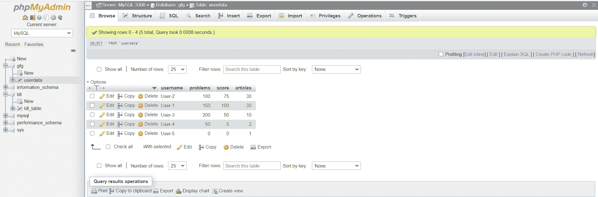
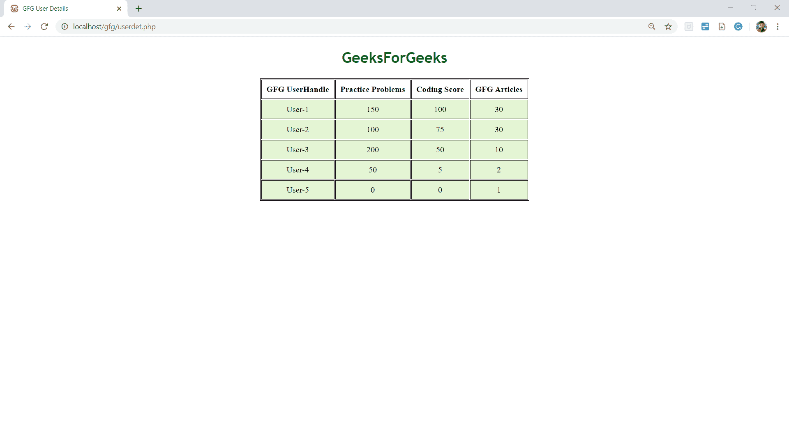

# 如何使用 PHP 从 localserver 数据库中获取数据并显示在 HTML 表格上？

> 原文:[https://www . geeksforgeeks . org/如何使用-php 从-local server-database-html-table-display 中获取数据/](https://www.geeksforgeeks.org/how-to-fetch-data-from-localserver-database-and-display-on-html-table-using-php/)

WampServer 是微软 Windows 操作系统的开源软件，由 Romain Bourdon 开发。它由 Apache web 服务器、支持 SSL 的 OpenSSL、MySQL 数据库和 PHP 编程语言组成。在这里，在完成程序之前，我们需要在本地主机服务器上创建一个 MySQL 数据库。然后，我们应该制作一个用 PHP 代码链接的 HTML 表。PHP 用于连接本地主机服务器，并通过评估 MySQL 查询从本地主机服务器中的数据库表中获取数据。Wampserver 帮助启动 Apache 和 MySQL，并用 PHP 文件连接它们。

考虑一下，我们有一个名为 *gfg* 的数据库，一个名为 *userdata* 的表。现在，下面是从数据库中获取数据并显示在一个 HTML 表中的 PHP 代码。

**创建数据库:**


**示例:**

```html
// PHP code to establish connection
// with the localserver
<?php

// Username is root
$user = 'root';
$password = ''; 

// Database name is gfg
$database = 'gfg'; 

// Server is localhost with
// port number 3308
$servername='localhost:3308';
$mysqli = new mysqli($servername, $user, 
                $password, $database);

// Checking for connections
if ($mysqli->connect_error) {
    die('Connect Error (' . 
    $mysqli->connect_errno . ') '. 
    $mysqli->connect_error);
}

// SQL query to select data from database
$sql = "SELECT * FROM userdata ORDER BY score DESC ";
$result = $mysqli->query($sql);
$mysqli->close(); 
?>
// HTML code to display data in tabular format
<!DOCTYPE html>
<html lang="en">

<head>
    <meta charset="UTF-8">
    <title>GFG User Details</title>
    <!-- CSS FOR STYLING THE PAGE -->
    <style>
        table {
            margin: 0 auto;
            font-size: large;
            border: 1px solid black;
        }

        h1 {
            text-align: center;
            color: #006600;
            font-size: xx-large;
            font-family: 'Gill Sans', 'Gill Sans MT', 
            ' Calibri', 'Trebuchet MS', 'sans-serif';
        }

        td {
            background-color: #E4F5D4;
            border: 1px solid black;
        }

        th,
        td {
            font-weight: bold;
            border: 1px solid black;
            padding: 10px;
            text-align: center;
        }

        td {
            font-weight: lighter;
        }
    </style>
</head>

<body>
    <section>
        <h1>GeeksForGeeks</h1>
        <!-- TABLE CONSTRUCTION-->
        <table>
            <tr>
                <th>GFG UserHandle</th>
                <th>Practice Problems</th>
                <th>Coding Score</th>
                <th>GFG Articles</th>
            </tr>
            <!-- PHP CODE TO FETCH DATA FROM ROWS-->
            <?php   // LOOP TILL END OF DATA 
                while($rows=$result->fetch_assoc())
                {
             ?>
            <tr>
                <!--FETCHING DATA FROM EACH 
                    ROW OF EVERY COLUMN-->
                <td><?php echo $rows['username'];?></td>
                <td><?php echo $rows['problems'];?></td>
                <td><?php echo $rows['score'];?></td>
                <td><?php echo $rows['articles'];?></td>
            </tr>
            <?php
                }
             ?>
        </table>
    </section>
</body>

</html>
```

**输出:**


CSS 是网页的基础，通过设计网站和网络应用程序用于网页开发。你可以通过以下 [CSS 教程](https://www.geeksforgeeks.org/css-tutorials/)和 [CSS 示例](https://www.geeksforgeeks.org/css-examples/)从头开始学习 CSS。

PHP 是一种专门为 web 开发设计的服务器端脚本语言。您可以通过以下 [PHP 教程](https://www.geeksforgeeks.org/php-tutorials/)和 [PHP 示例](https://www.geeksforgeeks.org/php-examples/)从头开始学习 PHP。