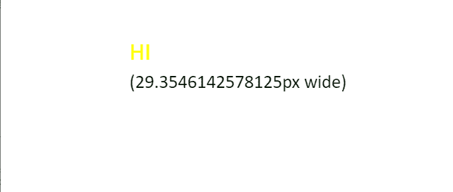
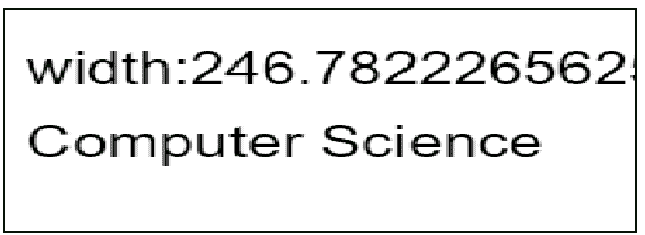

# 如何用 JavaScript 在 HTML 画布中找到一个文本的高度？

> 原文:[https://www . geesforgeks . org/如何使用 javascript 找到 html 画布中的文本高度/](https://www.geeksforgeeks.org/how-to-find-the-height-of-a-text-in-html-canvas-using-javascript/)

在本文中，我们将使用 JavaScript 找到文本画布的高度。

**方法:**在下面的例子中，使用了 HTML 画布的*高度*属性。首先在 *pt* 中设置字体来设置高度。

```html
context.font = '26pt Calibri';
```

然后，使用值“中间”和颜色“黄色”将当前文本居中对齐。

```html
context.textAlign = 'middle';
context.fillStyle = 'yellow';
```

然后，在写入画布之前，使用 *measureText()* 方法检查文本的宽度。最后，使用 *fillText()* 方法将文本写在画布上。

**例 1:**

## 超文本标记语言

```html
<!DOCTYPE HTML>
<html>

<head>
    <style>
        body {
            margin: 0px;
            padding: 0px;
        }
    </style>
</head>

<body>
    <canvas id="myCanvas" width="550" height="200">
    </canvas>
    <script>
        var canvas = document.getElementById('myCanvas');
        var context = canvas.getContext('2d');
        var x = canvas.width / 3;
        var y = canvas.height / 2 - 15;
        var text = 'HI ';

        // Set the font to set the height
        context.font = '26pt Calibri';
        context.textAlign = 'middle';
        context.fillStyle = 'yellow';
        context.fillText(text, x, y);
        context.font = '20pt Calibri';

        // Check the width of the text 
        var metrics = context.measureText(text);
        var width = metrics.width;

        // Text is aligned in the left      
        context.textAlign = 'left';
        context.fillStyle = '#010';

        context.fillText('(' + width 
            + 'px wide)', x, y + 40);
    </script>
</body>

</html>
```

**Output:**


**方法:**首先使用 *getContext()* 方法获取画布的 2d 绘制上下文。设置字体和文本字符串。然后使用下面给出的 *fillText()* 方法写出带有 x 和 y 坐标的文本。

**例 2:**

## 超文本标记语言

```html
<!DOCTYPE html>
<html>

<body>
    <canvas id="Canvas" width="300" height="150" 
        style="border:1px solid #010;">
        Your browser isn't supporting 
        HTML5 canvas tag.
    </canvas>

    <script>
        var c = document.getElementById("Canvas");
        var x = c.getContext("2d");
        x.font = "30px Arial";
        var txt = "Computer Science"
        x.fillText("width:" 
            + x.measureText(txt).width, 10, 50);
        x.fillText(txt, 10, 100);
    </script>
</body>

</html>
```

**Output:**
