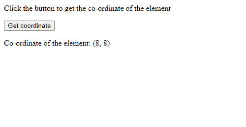

# 如何找到 HTML 元素在 JavaScript 中的位置？

> 原文:[https://www . geesforgeks . org/如何找到 html 元素在 javascript 中的位置/](https://www.geeksforgeeks.org/how-to-find-the-position-of-html-elements-in-javascript/)

给定一个 HTML 文档，任务是使用 JavaScript 获取任何元素的位置。使用以下步骤获取位置:
**第一步:选择元素:**在找到位置之前，需要选择所需的 HTML 元素。HTML 中的每个元素都是以树状格式构建的，称为 DOM 或文档对象模型。在 JavaScript 中，有一个名为 document 对象的内置对象指向 DOM 树的根。这意味着可以访问网页的每个组件。
文档对象有各种方法可以在 HTML 页面中找到特定的元素。这些方法中的每一个都有一个可以用来找到所需元素的参数。有些方法是:

*   **getElementsByTagName()** 方法
*   **getElementsByClassName()** 方法
*   **getElementById()** 方法
*   **getElementsByName()** 方法
*   **查询选择器()**方法
*   **查询选择全部()**方法

**第二步:找到元素的位置:**要获取(x，y)坐标格式的任何 HTML 元素的位置，有两个文档属性可以使用:

*   **offsetTop 属性:**返回相对于父元素顶部的顶部位置，以像素为单位。它包括元素的顶部位置和边距，以及其父元素的顶部填充、滚动条和边框。
    **例:**

## 超文本标记语言

```html
<!DOCTYPE html>
<html>

<body>
    <div id="target">

<p>Click the button</p>

        <button onclick="getPoint()">
            Click
        </button>

        <p id="output"></p>

    </div>

    <script>
        function getPoint() {
            var target = document
                .getElementById("target");

            var output = document
                .getElementById("output");

            output.innerHTML = "offsetTop: "
                    + target.offsetTop;
        }
    </script>
</body>

</html>
```

*   **输出:**

```html
offsetTop: 8
```

*   **offsetLeft 属性:**返回相对于父元素左侧的左侧位置，以像素为单位。它包括元素的左侧位置和边距，以及其父元素的左侧填充、滚动条和边框。
    **例:**

## 超文本标记语言

```html
<!DOCTYPE html>
<html>

<body>
    <div id="target">

<p>Click the button </p>

        <button onclick="getPoint()">
            Click
        </button>

        <p id="output"></p>

    </div>

    <script>
        function getPoint() {
            var target = document
                .getElementById("target");

            var output = document
                .getElementById("output");

            output.innerHTML = "offsetLeft: "
                    + target.offsetLeft;
        }
    </script>
</body>

</html>
```

*   **输出:**

```html
offsetLeft: 8

```

将这两个属性组合成一个，得到计算 HTML 元素坐标的代码，如下所示:

## 超文本标记语言

```html
<!DOCTYPE html>
<html>

<body>
    <div id="target">

<p>
            Click the button to get the
            co-ordinate of the element
        </p>

        <button onclick="getPoint()">
            Get coordinate
        </button>

        <p id="output"></p>

    </div>

    <script>
        function getPoint() {
            var target = document
                .getElementById("target");

            var output = document
                .getElementById("output");

            output.innerHTML =
                "Co-ordinate of the element:" +
                " (" + target.offsetLeft + ", "
                + target.offsetTop + ")";
        }
    </script>
</body>

</html>
```

**输出:**

