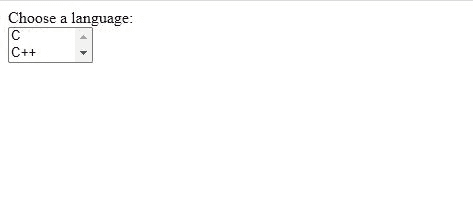
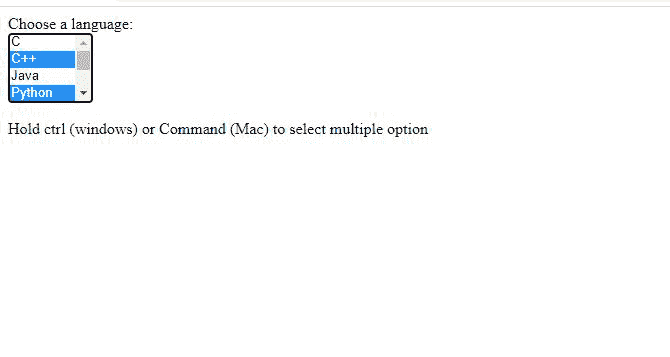

# 如何固定 HTML 下拉列表中可见项目的数量并允许多选？

> 原文:[https://www . geesforgeks . org/如何修复 html 中可见项目的数量下拉列表并允许多选/](https://www.geeksforgeeks.org/how-to-fix-number-of-visible-items-in-html-dropdown-and-allow-multiple-selections/)

下拉菜单提供了可供选择的选项列表。HTML select 标签用于创建下拉列表。

当下拉列表中的选项数量很大时，固定可见项目的数量可能会很有用。这可以通过使用<select>标签的“大小”属性来完成。</select>

在下面的示例中，一次可以看到 2 个项目，因为 size 属性的值设置为 2。

**例 1:**

```html
<!DOCTYPE html>
<html>

<body>
   Choose a language:<br>
   <select id="language" size="2" >
       <option value="C">C</option>
       <option value="C++">C++</option>
       <option value="Java">Java</option>
       <option value="Python">Python</option>
       <option value="R">R</option>
       <option value="HTML">HTML</option>
       <option value="JavaScript">JavaScript</option>
   </select>
</body>

</html>
```

**输出:**



在上面的示例中，只能从列表中选择一个项目。为了实现多重选择，使用了“多重”属性。在以下示例中，按住 Ctrl 键(窗口)或 Command 键(Mac)可以选择多个选项:

**例 2:**

```html
<!DOCTYPE html>
<html>

<body>
   Choose a language:<br>

   <select id="language" size="4" multiple>
       <option value="C">C</option>
       <option value="C++">C++</option>
       <option value="Java">Java</option>
       <option value="Python">Python</option>
       <option value="R">R</option>
       <option value="HTML">HTML</option>
       <option value="JavaScript">JavaScript</option>  
   </select>

   <p>
       Hold ctrl (windows) or Command 
       (Mac) to select multiple option
   </p>    
</body>

</html>
```

**输出:**

