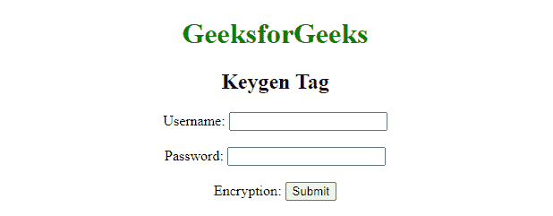

# 如何在 HTML 中生成公钥？

> 原文:[https://www . geesforgeks . org/如何生成 html 中的公钥/](https://www.geeksforgeeks.org/how-to-generate-public-key-in-html/)

您可以使用 HTML 中的**[**<keygen>**](https://www.geeksforgeeks.org/html-keygen-tag/)标签轻松生成公钥。 **< keygen >** 元素生成加密密钥，用于将加密数据传递给服务器。< keygen >元素的目的是提供一种安全的方法来验证用户。**

**实际上，当提交表单时，会生成两个密钥，私钥和公钥。私钥存储在本地，公钥发送到服务器。公钥用于生成客户端证书，以便将来验证用户。**

****语法:****

```html
<keygen name="name" challenge="challenge" 
    keytype="type" keyparams="pqg-params">
```

****属性值:****

*   ****名称:**指定与表单数据一起提交的 keygen 元素的名称。**
*   ****密钥类型:**指定要生成的密钥类型。值为“RSA”、“DSA”和“EC”，默认情况下为“RSA”。**
*   ****挑战:**与公钥一起提交的挑战字符串。如果未指定，则默认为空字符串。**
*   ****形态:**指定 **<键根>** 元素所关联的 **<形态>** 元素。**

****注意:****关键参数属性是生成 DSA 和 EC 密钥所必需的。****

******示例:******

## ****超文本标记语言****

```html
**<!DOCTYPE html>
<html>

<body>
    <center>
        <h1 style="color:green;">
            GeeksforGeeks
        </h1>

        <h2>Keygen Tag</h2>

        <form>
            <label>Username:
                <input type="text" name="username"></label>
            </br>
            <label>Password:
                <input type="password" name="password"></label>
            </br>
            <label>Encryption: <keygen name="key"></label>
            <input type="submit" value="Submit">
        </form>
    </center>
</body>

</html>     **
```

******输出:******

****

keygen 标签****