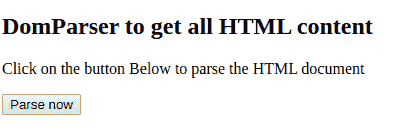

# 如何从 DOMParser 获取除外体标签以外的所有 HTML 内容？

> 原文:[https://www . geesforgeks . org/how-to-all-html-content-from-DOM parser-exclude-body-tag/](https://www.geeksforgeeks.org/how-to-get-all-html-content-from-domparser-excluding-the-outer-body-tag/)

DOM(文档对象模型)允许我们动态地访问和操作 HTML 数据。HTML 文件中的所有文本数据也可以使用 DOMParser 提取。DOM 解析器返回一个 HTML/XML/SVG 对象。所有的对象都可以使用 javascript 中的[ ]操作符来访问。

**对象的 HTML DOM 树:**


**使用 DOMParser 从 HTML 文档中获取所有文本的步骤:**

1.  声明一个 DOMParser 的实例。
    **语法:**

```html
const parser = new DOMParser();
```

*   使用`.parseFromString() function`解析文档。它需要两个参数，待解析的字符串和文档类型。
    **语法:**

    ```html
    const parsedDocument = parser.parseFromString(
            htmlInput, "text/html");
    ```

    *   Use doc.all element to access the whole HTML page, now get its root element which is stored at 0<sup>th</sup> index. We can also use getElementByID() to get content of a specific element.
    **Syntax:**

    ```html
    var allText = parsedDocument.all[0].textContent;
    ```

    最后，我们将使用 doc.all[0]的 textContent 属性从所有 HTML 元素中获取文本。

    **示例:**

    ```html
    <title>This is the title</title>
    <div>
        <span>Geeks for geeks</span>
        <p>Content to be parsed </p>
    </div>
    ```

    **输出:**

    ```html
    This is the title 
    Geeks for geeks
    Content to be parsed
    ```

    **代码:**

    ```html
    <!DOCTYPE html>
    <html lang="en" dir="ltr">

    <head>
        <title>
            Dom Parser Inner Content
        </title>
    </head>

    <body>
        <h2>
            DomParser to get 
            all HTML content
        </h2>

        <p>
            Click on the button Below 
            to parse the HTML document
        </p>

        <!-- Paragraph element to 
             show the output -->
        <p id="output"> </p>

        <!-- Button to call the 
             parsing function -->
        <button onclick="printOutput()">
            Parse now
        </button>

        <script>

            // Input HTML string to be parsed
            var htmlInput = `
        <title> This is the title </title>
        <div>
          <span>Geeks for geeks</span>
          <p> Content to be parsed </p>
        </div>
      `;

            // Created instance
            const parser = new DOMParser();

            // Parsing
            const parsedDocument =
                        parser.parseFromString(
                        htmlInput, "text/html");

            // Getting text
            function printOutput() {

                var allText = parsedDocument
                         .all[0].textContent;

                // Printing on page and console
                document.getElementById("output")
                            .innerHTML = allText;

                console.log(parsedDocument
                            .all[0].textContent);
            }
        </script>
    </body>

    </html>
    ```

    **输出:**
    **按下按钮前:**
    
    **按下按钮后:**
    

    也可以使用 getElementsByClassName(' class name ')和 getElementById('IDName ')检索单个组件的文本内容。

    **将待解析文档作为字符串并打印结果的 Javascript 函数。**

    ```html
    function parse(htmlInput) {

        // Creating Praser instance
        const parser = new DOMParser();

        // Parsing the document using DOM Parser
        // and storing the returned HTML object in
        // a variable
        const parsedDocument = parser
            .parseFromString(htmlInput, "text/html");

        // Retrieve all text content from DOM object
        var allText = parsedDocument.all[0].textContent;

        // Printing the output to webpage and
        console.log(parsedDocument.all[0].textContent);
    }
    ```