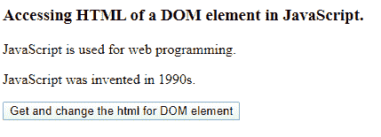
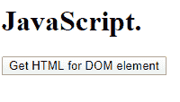

# 如何在 JavaScript 中获取/更改带有 DOM 元素的 HTML？

> 原文:[https://www . geeksforgeeks . org/如何用 javascript 中的 dom 元素更改 html/](https://www.geeksforgeeks.org/how-to-get-change-the-html-with-dom-element-in-javascript/)

为了获取/访问 JavaScript 中 DOM 元素的 HTML，第一步是根据元素的 id、名称或标签名来识别元素。然后，我们可以使用 inner.HTML 或 outer.HTML 来获取 HTML。

**1。使用 getElementById()方法:**该方法使用 DOM 元素的 Id 获取/标识 DOM 元素，并返回元素。

**示例:**

## java 描述语言

```html
<!DOCTYPE html>
<html>

<head>
    <title>
        How to get/change the HTML with
        DOM element in JavaScript?
    </title>
</head>

<body>
    <h3>
        Accessing HTML of a DOM
        element in JavaScript.
    </h3>

    <p id="iD1">
        JavaScript is used for web programming.
    </p>

    <button onclick=getHtml()>
        Get and change the html for DOM element
    </button>

    <script>
        function getHtml() {
            var Element = document.getElementById("iD1");
            alert(Element.innerHTML);
            Element.style.color = "orange";
            Element.innerHTML = "GeeksforGeeks";
        }
    </script>
</body>

</html>
```

**输出:**

*   **点击按钮前:**


*   **点击按钮后:**


**2。使用 getElementByName()方法:**该方法通过使用 DOM 元素的类名来获取/识别 DOM 元素，并返回元素。

**示例:**

## java 描述语言

```html
<!DOCTYPE html>
<html>

<head>
    <title>
        How to get/change the HTML with
        DOM element in JavaScript?
    </title>
</head>

<body>

    <h3>
        Accessing HTML of a DOM
        element in JavaScript.
    </h3>

    <p class="p1">
        JavaScript is used for web programming.
    </p>

    <button onclick=getHtml()>
        Get and change the html
        for DOM element
    </button>

    <script>
        function getHtml() {
            var Element =
                document.getElementsByClassName("p1");

            alert(Element[0].innerHTML);
            Element[0].style.color = "blue";
            Element[0].innerHTML = "GeeksforGeeks";
        }
    </script>
</body>

</html>
```

**输出:**

*   **点击按钮前:**


*   **点击按钮后:**


**3。使用 getElementsByTagName():** 此方法使用 DOM 元素的标记名获取/标识 DOM 元素并返回它。

**示例:**

## java 描述语言

```html
<!DOCTYPE html>
<html>

<head>
    <title>
        How to get/change the HTML with
        DOM element in JavaScript?
    </title>
</head>

<body>
    <h3>
        Accessing HTML of a DOM
        element in JavaScript.
    </h3>

<p>JavaScript is used for web programming.</p>

<p>JavaScript was invented in 1990s.</p>

    <button onclick=getHtml()>
        Get and change the html for DOM element
    </button>

    <script>
        function getHtml() {
            var Element = document.getElementsByTagName("p");
            for (var i = 0; i < Element.length; i++) {
                alert(Element[i].innerHTML);
                Element[i].innerHTML = "GeeksforGeeks.";
            }
        }
    </script>
</body>

</html>
```

**输出:**

*   **点击按钮前:**



*   **点击按钮后:**


**注意:**以上三种方法使用 DOM 元素的 inner.HTML 属性来获取 HTML 并向其发出警告，然后更改元素中存在的 HTML 内容。属性 inner.HTML 主要用于更改文本，或者更确切地说是当前的内容，而 outer.HTML 用于更改标签和文本内容，因为它返回 HTML 内容及其标签。

下面的示例说明了如何使用 getElementsByTagName()方法来使用 outer.HTML 属性。

## java 描述语言

```html
<!DOCTYPE html>
<html>

<head>
    <title>
        How to get/change the HTML with
        DOM element in JavaScript?
    </title>
</head>

<body>

    <div> GeeksforGeeks </div>

    <button onclick=getHtml()>
        Get HTML for DOM element
    </button>

    <script>
        function getHtml() {
            var Element = document.getElementsByTagName("div");
            alert(Element[0].outerHTML);
            Element[0].style.color = "red";
            Element[0].outerHTML = "<h1> JavaScript. </h1>"
        }
    </script>
</body>

</html>
```

**输出:**

*   **点击按钮前:**


*   **点击按钮后:**



函数 getElementById()，getElementsByClassName()也可以用来获取用于访问外部 HTML 的 DOM 元素，其方式与用于访问内部 HTML 的方式相同。因此，我们可以使用上述方法访问一个 DOM 的 HTML。