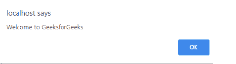

# 当页面使用 HTML 加载时，如何自动聚焦一个按钮？

> 原文:[https://www . geesforgeks . org/how-to-focus-a-button-当页面加载时自动使用-html/](https://www.geeksforgeeks.org/how-to-get-focused-a-button-automatically-when-the-page-load-using-html/)

HTML 中的<button>标签用来定义可点击的按钮。</button><button>标签用于提交内容。图像和文本内容可以在</button><button>标签内使用。</button>

<button>*自动对焦*属性用于加载网页后自动获取对焦按钮。</button>

**语法:**

```html
<button type="" autofocus> Submit <button>
```

**例 1:**

## 超文本标记语言

```html
<!DOCTYPE html>
<html>

<body>
    <h1 style="color:green;">
        GeeksforGeeks
    </h1>

    <h3>
        How to specify that a button 
        should automatically get 
        focus when the page load?
    </h3>

    <!-- button tag starts from here -->
    <button type="button" autofocus 
        onclick="alert('Welcome to GeeksforGeeks')">
        Click Here
    </button>
    <!-- button tag ends here -->

</body>
</html>
```

**输出:**

*   

    单击提交按钮时，会向用户显示以下警告消息框。

*   

**例 2:**

## 超文本标记语言

```html
<!DOCTYPE html>
<html>

<body>
    <h1 style="color:green;">
        GeeksforGeeks
    </h1>
    <h3>
        How to specify that a button 
        should automatically get 
        focus when the page load?
    </h3>

    <!-- button tag starts from here -->
    <button type="button" autofocus onclick="myFun()">
        Click Here
    </button>
    <!-- button tag ends here -->

    <p id=result></p>

    <script>
        function myFun()
        {
            document.getElementById("result")
               .innerHTML = "Welcome to GeeksforGeeks";
        }
    </script>
</body>
</html>
```

**输出:**

