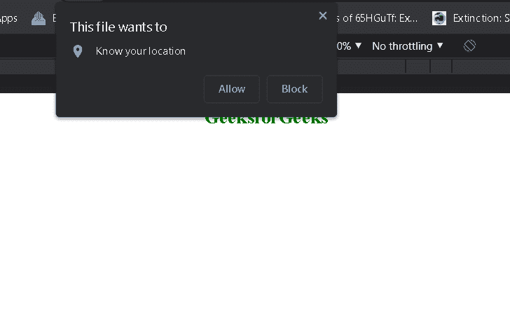
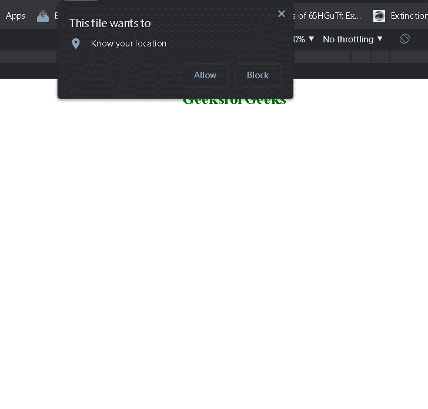

# 如何在 HTML5 中获取用户的地理位置？

> 原文:[https://www . geesforgeks . org/如何获取 html5 中用户的地理位置/](https://www.geeksforgeeks.org/how-to-get-geographic-position-of-a-user-in-html5/)

**简介:**在本文中，我们将看到如何在 HTML5 中获取用户的地理位置。

**方法:**在 HTML5 中获取用户的地理位置，我们使用[地理定位 API](https://www.geeksforgeeks.org/html-geolocation/) 。HTML5 中的地理位置用于在用户允许的情况下与某些网站共享用户的位置。它使用 JavaScript 获取经纬度。大多数浏览器都支持地理定位应用编程接口。

**语法:**

> var location = navigator . geo location . get current location()

上述语法中的变量位置具有以下属性:

*   **坐标纬度:**始终以十进制数返回纬度
*   **坐标精度:**始终返回位置精度
*   **坐标经度:**始终以十进制数返回经度
*   **坐标高度:**返回海拔高度(如果可用)
*   **坐标高度精度:**返回位置的高度精度(如果可用)
*   **坐标航向:**从北顺时针返回航向度数(如果可用)
*   **坐标速度:**返回主生产计划中的速度(如果可用)
*   **时间戳:**返回响应日期或时间(如果可用)

**示例 1:** 在本例中，我们将使用使用地理定位 API 创建的 Location 对象显示用户权限的经度和纬度。

## 超文本标记语言

```html
<!DOCTYPE html>
<html>

<head>
    <title>Latitude and longitude</title>
</head>

<body>
    <center>
        <h1 class="gfg" style="color:green;">
            GeeksforGeeks
        </h1>

        <h2 id="Location"></h2>
    </center>

    <script>
        var Location = document.getElementById("Location");
        navigator.geolocation.getCurrentPosition(showLocation);

        function showLocation(position) {
            Location.innerHTML =
                "Latitude: " + position.coords.latitude +
                "<br>Longitude: " + position.coords.longitude;
        }
    </script>
</body>

</html>
```

**输出:**



输出

**示例 2:** 在本例中，我们使用地图框，使用我们到达的经纬度来显示用户在地图上的位置。以下是创建谷歌地图框的步骤:

**第一步:**在 HTML 页面中添加以下脚本，启用 google 地图框功能。

```html
<script src=
 "https://maps.google.com/maps/api/js?sensor=false"></script>
```

**步骤 2:** 使用以下命令创建具有经度和纬度坐标的网格对象:

```html
var lattlong = new google.maps.LatLng(latitude, longitude);
```

**步骤 3:** 使用以下代码创建地图框，以用户在 div 中的位置为中心，id 为 Map:

```html
var Mapmain = new google.maps.Map(document.getElementById("Map"));
```

下面是上述方法的实现。

## 超文本标记语言

```html
<!DOCTYPE html>
<html>

<head>
    <title>Latitude and longitude</title>
    <script src=
"https://maps.google.com/maps/api/js?sensor=false">
    </script>
</head>

<body>
    <center>
        <h1 style="color:green;">
            GeeksforGeeks
        </h1>

        <div id="Map" style="width:700px; height:500px"></div>
    </center>
    <script>
        var Location = document.getElementById("Location");
        navigator.geolocation.getCurrentPosition(showLocation);

        function showLocation(position) {
            latt = position.coords.latitude;
            long = position.coords.longitude;
            var lattlong = new google.maps.LatLng(latt, long);
            var Options = {
                center: lattlong,
                zoom: 15,
                mapTypeControl: true,
                navigationControlOptions:
                    { style: google.maps.NavigationControlStyle.SMALL }
            }
            var Mapmain = new google.maps.Map
                (document.getElementById("Map"), Options);
            var markerpos =
                new google.maps.Marker
                    ({ position: lattlong, map: Mapmain });
        }
    </script>
</body>

</html>
```

**输出:**



输出